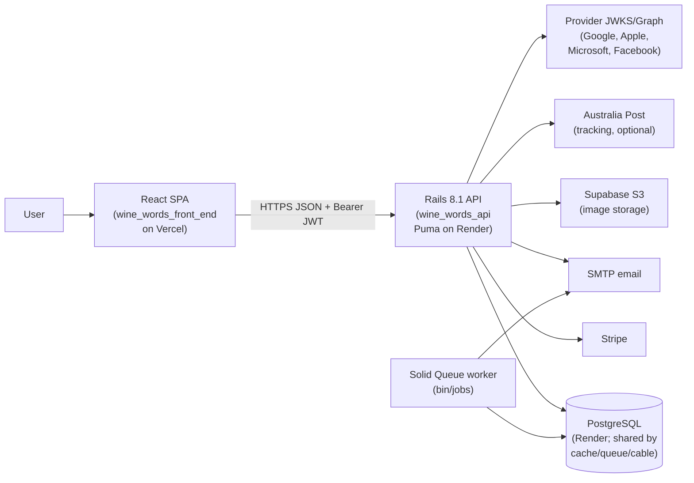
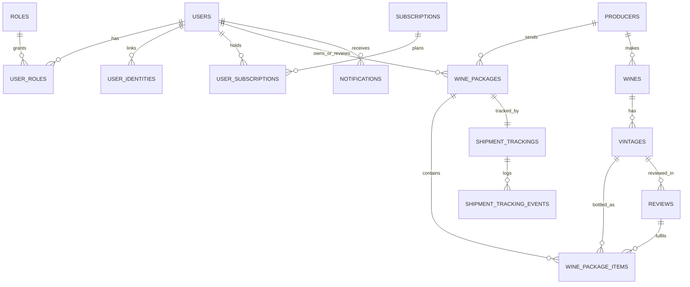
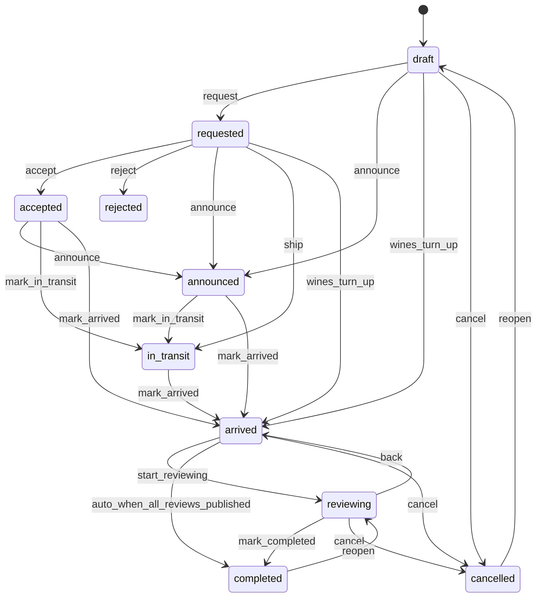

# Wine Words — Project Documentation (shared, verified)

> Generated 2026-09-24 from working trees `wine_prediction` (frontend) and
> `wine_prediction_api` (backend). Documents **implemented, verified**
> functionality only. Planned items are explicitly marked.

## 1. What Wine Words is

Wine Words is a wine review/content platform with:

- Public wine catalogue: wines, vintages, producers, grapes, regions,
  countries, categories, tags, taste parameters, wine profiles.
- Reviews (draft → published) and articles with galleries.
- **Wine packages workflow:** producers send/announce wines → reviewer owns
  package → shipment tracking (Australia Post or manual) → arrival starts a
  one-month review deadline → reminder emails at 15/5/0 days.
- Users/roles, social + password auth, admin impersonation, audit logs.
- Subscriptions + Stripe billing (seeded plans; entitlements are metadata).
- Admin: configuration API, API-health console, logs, stats.
- Ops: Solid Queue jobs, daily encrypted DB backups to Cloudflare R2.

## 2. Repositories and live environments

Local folders (not repo names):

| App | Local folder | GitHub canonical |
|---|---|---|
| Frontend | `../wine_prediction` | `https://github.com/romalopes/wine_words_front_end` (clone remote still uses pre-rename `wine_finder_quiz`) |
| Backend | `.` (`wine_prediction_api`) | `https://github.com/romalopes/wine_words_api` (clone remote still uses pre-rename `wine_prediction_api`) |

Verified live:

| What | URL | Verified status |
|---|---|---|
| Web app | `https://wine-prediction-mu.vercel.app` | Live, title "Wine Words"; bundle embeds Render API URL |
| API | `https://wine-prediction-api-mq4a.onrender.com` | Live; `/api/v1/health` 200 `{"status":"ok","database":"ok","version":"0.0.20"}`; `/api/v1/stats` 200; `/api/v1/health/detailed` 401 unauthenticated |
| Legacy frontend | `wine-prediction-app.vercel.app` | Retired (`DEPLOYMENT_NOT_FOUND`); still listed in CORS — cleanup pending |

Version: API `0.0.20` (`config/initializers/app_version.rb`).
Status: active development, private-testing gate enabled in production.

## 3. Architecture



Notes:

- SPA is fully client-side (react-router, Vercel SPA rewrite to `index.html`).
- All data access is JSON under `/api/v1` with Bearer JWT; session restore via `GET /me`.
- Same Rails app also renders server-side pages (`web/*` controllers: library, quiz/finder, about, subscribe, account) from `/`. The SPA is the primary surface.
- Jobs run on Solid Queue (DB-backed). Recurring schedule in `config/recurring.yml`: hourly subscription reconciliation, daily 07:00 review-deadline reminders, hourly finished-job cleanup.

## 4. Technology stack

| Layer | Technology | Version/source |
|---|---|---|
| Frontend | React, Vite, react-router | `^19.0.0`, `^6.4.3`, `^7.3.0` (`wine_prediction/package.json`) |
| Frontend UI/tests | react-bootstrap/Bootstrap 5, DOMPurify, Vitest 4 + Testing Library + jsdom, ESLint 9 flat config | `^2.10.9`/`^5.3.3`, `^3.4.14`, `^4.1.11`; `scripts/smoke-test.js` |
| Backend language/framework | Ruby, Rails | `3.4.2` (`.ruby-version`), `~> 8.1.3` (`Gemfile`) |
| Backend data | PostgreSQL, Active Storage, Solid Cache/Queue/Cable | `pg ~> 1.1`; storage/dev+prod Supabase S3; Solid adapters |
| Auth | Devise, devise-jwt, bcrypt, JWT denylist | Verified in `Gemfile`, `User`, `config/initializers/devise.rb` |
| Billing | Stripe | `stripe` gem; adapter architecture; webhook + reconcile job |
| Search | `pg_trgm`, optional local Ollama LLM search | `LlmSearchService`; `OLLAMA_*` env; graceful fallback |
| Quality/security | RSpec, RuboCop omakase, Brakeman, bundler-audit | `rspec-rails ~> 7.0`; `bin/*`; CI `ci.yml` |

Local toolchain at documentation time (not pinned): Node `24.6.0`, npm `11.6.0`, psql `14.19`. No `.nvmrc`/`engines`; `.ruby-version` pins Ruby.

## 5. Workspace and repository layout

Workspace root is **not** a git repository (verified); keep this document here
or copy it into one/both repos.

```text
wine_project/
├── wine_prediction/        # React SPA (repo romalopes/wine_words_front_end)
└── wine_prediction_api/    # Rails app (repo romalopes/wine_words_api)
    ├── WINE_WORDS_README.md   # this file (shared draft location)
    ├── README.md              # stub (untouched)
    ├── docs/                  # DATABASE_BACKUP_AND_RESTORE.md,
    │                          # social_authentication.md, wine_packages.md,
    │                          # general_info.md (do not duplicate)
    └── secrets/ (workspace root) # WARNING: contains a live Google client
                                  # secret JSON; out-of-repo by luck, must be
                                  # removed/rotated. Not quoted here.
```

`wine_prediction/react-router/` is an unused scaffold, not part of the build.
`wine_prediction/dist/` is local build output only.

## 6. Project structure

Frontend `src/` (verified excerpt):

```text
src/
├── components/      # ~100 files incl. *.test.jsx and pages
├── constants/roles.js, versions.js, winePackages.js
├── contexts/AuthContext.jsx, TestAccessContext.jsx
├── data/ hooks/ services/api.js, apiHealth.js, notificationEvents.js,
│   socialProviders.js, useApi.js  # api.js: 1,088 lines, ~35 API groups
├── styles/ utils/ assets/
├── App.jsx  # TestAccessProvider > AuthProvider > Router > Gate/Header/Routes/Footer
└── components/AppRoutes.jsx  # ~45 routes
```

Backend `app/` (verified excerpt):

```text
app/
├── controllers/api/v1/  # ~36 controllers
├── controllers/web/     # SSR pages + legacy CRUD scaffolds
├── controllers/concerns/test_access.rb, wine_package_authorizable.rb
├── models/              # ~50 incl. User, Role, WinePackage, Image, subscriptions
├── serializers/         # 11 + pagination helpers
├── services/            # social auth chain, billing chain, package services,
│                        # tracking providers (manual + australia_post),
│                        # llm_search_service, test_access_token
├── jobs/billing/reconcile_subscriptions_job.rb
├── jobs/wine_packages/send_review_deadline_notifications_job.rb
├── mailers/email_verifications_mailer.rb, wine_packages_mailer.rb
└── javascript/          # Stimulus controllers for SSR surface
```

Operational files: `config/routes.rb`, `config/recurring.yml`, `render.yaml`,
`Procfile`, `bin/*`, `.github/workflows/*`, `db/schema.rb` (986 lines,
69 tables, schema version `2026_09_20_122659`).

## 7. Domain model



Images use a polymorphic `Image` model (ordering, single primary, 10 MB/type
validation) — not bare Active Storage attachments. Review links to package
items (`review_requested` + `review_id`). **Not modelled:** likes, comments,
producer portal accounts.

## 8. Local development

Prerequisites: Ruby `3.4.2`, Bundler, PostgreSQL 14+, Node 24/npm 11
(unpinned), Git. Optional: local Ollama (`llama3.2:3b`), Stripe CLI.

Frontend (`../wine_prediction`):

```bash
npm install
cp .env.example .env.development   # then set VITE_API_BASE_URL
npm run dev                        # http://localhost:5173
```

Backend (`.`):

```bash
bundle install
cp .env.example .env.development   # then set DATABASE_URL etc.
bin/rails db:prepare               # create + migrate + seed
bin/rails server                   # http://localhost:3000
```

Scripts: frontend `dev/build/vercel --prod/lint/preview/test` (vitest);
backend `bin/setup`, `bin/rails server`, `bin/jobs` (Solid Queue worker),
`bin/ci`, `bin/rubocop`, `bin/brakeman`, `bin/bundler-audit`.

## 9. Environment variables

Frontend (`.env.example`; `VITE_*` is public by design — no secrets):
`VITE_API_BASE_URL` (default `http://localhost:3000/api/v1`),
`VITE_NEON_AUTH_URL` / `VITE_NEON_AUTH_URL_PRODUCTION` (legacy — not read in
`src/`), `VITE_USE_FAKE_AUTH` (legacy — local env files only, not in `src/`),
`VITE_GOOGLE_CLIENT_ID`, `VITE_APPLE_CLIENT_ID`, `VITE_APPLE_REDIRECT_URI`,
`VITE_MICROSOFT_CLIENT_ID`, `VITE_MICROSOFT_TENANT_ID` (`common`),
`VITE_FACEBOOK_APP_ID`, `VITE_FACEBOOK_GRAPH_VERSION` (`v21.0`).

Backend (`.env.example`, required in production): `DATABASE_URL`,
`FRONTEND_URL`, `RAILS_MASTER_KEY`, `GOOGLE_CLIENT_ID`,
`APPLE_CLIENT_ID/TEAM_ID/KEY_ID/PRIVATE_KEY`,
`MICROSOFT_CLIENT_ID/TENANT_ID`, `FACEBOOK_APP_ID/APP_SECRET/GRAPH_VERSION`,
`AUSTRALIA_POST_API_KEY/TRACKING_URL/API_URL`, `TEST_ACCESS_PASSWORD`,
`TEST_ACCESS_TOKEN_EXPIRATION`, `SMTP_*`,
`STRIPE_PUBLISHABLE_KEY/SECRET_KEY/WEBHOOK_SECRET`, `BILLING_PROVIDER`,
`REQUIRE_EMAIL_VERIFICATION`, `EMAIL_VERIFICATION_EXPIRATION_HOURS`,
`SUPABASE_S3_*`, `OLLAMA_BASE_URL/OLLAMA_MODEL`. Optional alternates exist
for Neon/R2/AWS storage and backup.

## 10. Authentication and authorization

- Password auth: Devise + `devise-jwt`; token in the `Authorization` response
  header, stored in `localStorage` (`wine_prediction_token`), sent as
  `Bearer`; sign-out revokes via `jwt_denylists`.
- Social auth: client obtains the provider credential, `POST
  /api/v1/auth/{google,apple,microsoft,facebook}`; server verifies against
  JWKS (Google/Apple/Microsoft) or Graph (Facebook), then links/creates
  `user_identities`. Details: `docs/social_authentication.md`.
- Email verification: optional gate (`REQUIRE_EMAIL_VERIFICATION`); login
  returns `email_verification_required`; link is `GET
  /api/v1/email-verifications/:token`.
- Production test-access gate: `POST /api/v1/test_access`
  (`TEST_ACCESS_PASSWORD`) → signed `X-Test-Access-Token` in
  `sessionStorage`; API 401s carry `test_access_required`.
- Admin guard: `real_current_user&.admin?`; impersonation issues a JWT with
  impersonator claim + banner; self-role-removal and self-demotion blocked.
- Wine packages: **Admin/Editor** see all packages; **Reviewer** sees own
  (`reviewer_id` or created); creation is open to any wine manager
  (**Admin/Editor/Reviewer**).

## 11. Roles and permissions (verified)

Seeded roles: **Admin, Editor, Reviewer, Reader, Guest** (`Role` enum). There
is no "Super User".

| Capability | Admin | Editor | Reviewer | Reader | Guest |
|---|---|---|---|---|---|
| Users/roles/subscriptions, logs, config, impersonation, API health | yes | no | no | no | no |
| All content + packages workflow | yes | yes | packages + reviews; can create packages | no | no |
| Published content | yes | yes | yes | yes | partial (plan-gated) |

FREE maps the base role Guest, paid maps Reader; privileged roles are
independent. Plan content entitlements are **not enforced in code** (metadata).

## 12. Subscriptions and billing

Seeded plans (yearly AUD): **FREE (0)**, **Consumer ($70)**, **Trade ($240)**,
**Distributor ($400)**, **Retail ($600)** with a feature catalogue
(`SubscriptionFeature`). Stripe: checkout → `confirm_checkout` (apply), portal
session, prorated **upgrade** (immediate) / **downgrade** (scheduled in
`subscription_changes`), `webhooks/stripe` + hourly `Billing::
ReconcileSubscriptionsJob`. Admin `assign_subscription` (no downgrades).
Single active `UserSubscription` per user; base role synced on change.

## 13. Wine packages workflow

Statuses: `draft requested accepted rejected announced in_transit arrived
reviewing completed cancelled`, with a server-side transition guard; only
managers act. `arrived` stores the arrival timestamp and starts the **one-month review
deadline** (`Review window = 1 calendar month`; `review_deadline` is settable
but never overwritten once present, `MarkArrived`); if every requested item
already has a published review, the package completes immediately
(`CheckCompletion`). A `reviewer` (any signed-in user — the Reviewer role is
not required for ownership) defaults to the creator; sources are `manual /
unexpected / producer_request / producer_announcement` and are workflow-owned
(not editable after creation). Items link vintages with `review_requested`;
`create_review` pre-fills and links back. Singleton `ShipmentTracking`
(`manual`/`australia_post`) with `refresh_tracking`; delivery info never
marks arrival. Reminders at **15/5/0 days** before deadline via Solid Queue
(`config/recurring.yml`, 07:00 daily) + `WinePackagesMailer` with
`FRONTEND_URL` links.



## 14. API reference (from `config/routes.rb`)

Auth/session: `POST /api/v1/auth/sign_up|sign_in|sign_out`,
`POST /api/v1/auth/passwords`, `GET/POST /api/v1/email-verifications`,
`POST /api/v1/auth/{google,apple,microsoft,facebook}`,
`GET/POST/DELETE /api/v1/auth/identities`, `GET /api/v1/me`,
`PATCH /api/v1/me|cancel`. Catalogue (public reads; writes need role):
`wines` (`search grouped advanced_search`), `wines/:id/vintages`,
`vintages/:id/reviews`, `reviews` (`my_reviews grouped`), `articles`
(`my_articles grouped`), `producers` (`search`), `categories`,
`wine_profiles` (`search`), `taste_parameters`, `grapes` (`search`),
`countries`, `regions` (`tree`). Packages: full CRUD `wine_packages` + members
(`accept reject mark_in_transit mark_arrived mark_completed reopen cancel`),
creation-time entry statuses (`draft requested announced arrived`; arbitrary
status can never be written directly), nested `items` (`create update
destroy` + `create_review` per item), singleton `shipment_tracking` (`show
update` + `refresh`). Handled 404s (not 403) for invisible packages.
Notifications: `index mark_read mark_all_read`. Billing: `checkout portal
confirm change preview confirm`; `POST /api/v1/webhooks/stripe`. Admin
(Admin only): `users` (`search assign_roles assign_subscription`), `roles`,
`configuration` + `settings` (+ test-email), `logs/audit`, `stats`,
`impersonation`, `api/v1/health/detailed` (public `/api/v1/health`). Images:
`POST /api/v1/images`, `DELETE /api/v1/images/:id`, `PATCH
/api/v1/wines|reviews|articles/:id/images/reorder|set_primary` (role). Test
access: `POST/GET /api/v1/test_access`. Web SSR: `/` dashboard, `quiz`,
`finder`, `search`, `about`, `subscribe`, `account`, `wines/:slug` archive.

## 15. Frontend to API integration

`wine_prediction/src/services/api.js` wrapper: JSON + `Bearer` from
`localStorage`, `X-Test-Access-Token` from `sessionStorage`, `credentials:
'include'`, `Authorization`-response capture, normalized errors, 401
`test_access_required` redirect to `/test-access`. `VITE_API_BASE_URL` is
baked at build time (deployed bundle points at the Render API). CORS
allow-list: `localhost:5173`, `http(s)://wine-prediction-mu.vercel.app`,
legacy `wine-prediction-app.vercel.app` (retired — remove).

## 16. Database

PostgreSQL with `pg_trgm`; 69 tables (`db/schema.rb`,
`2026_09_20_122659`). Seeds: `db/seeds.rb` runs `subscriptions` (plans +
features), `demo` (roles/users), `wine_data` (catalogue, idempotent
`find_or_create_by!`), `packages`, `content`; `bin/setup` runs `db:prepare`.
Storage: dev + prod Supabase S3; test local disk.

## 17. Testing, CI and delivery

Frontend: `npm test` (Vitest + jsdom, 13 spec files), `npm run lint`
(ESLint 9 flat + react-hooks/refresh), `npm run build`,
`scripts/smoke-test.js`. Backend: `bin/rails db:test:prepare`, `bundle exec
rspec` (70 spec files), `bin/rubocop`, `bin/brakeman`, `bin/bundler-audit`.
CI (`.github/workflows/ci.yml`): Brakeman, bundler-audit, RuboCop (PRs +
main), `bin/rails db:test:prepare test` (Postgres service). Dependabot weekly
(bundler + actions). Backups: daily 02:00 UTC `pg_dump` → age-encrypted →
R2; weekly Sunday 03:00 UTC restore test; daily 06:00 UTC 36 h freshness
check (Slack). See `docs/DATABASE_BACKUP_AND_RESTORE.md`.

## 18. Deployment and operations

Frontend → Vercel (`vercel --prod`; project `wine-prediction`;
`vercel.json` SPA rewrite; set `VITE_API_BASE_URL` + public IDs at build).
Backend → Render blueprint `render.yaml`: web `wine-prediction-api` (Docker
runtime, `bundle exec puma -C config/puma.rb`, `releaseCommand: bin/rails
db:prepare`, `autoDeploy`, branch `main`) + worker `wine-prediction-worker`
(`bin/jobs`; `SOLID_QUEUE_IN_PUMA=false`, `JOB_CONCURRENCY=3`) + Postgres
`wine-prediction-db`. Note: `render.yaml` declares `healthCheckPath: /up`
but `/up` returned **404** when probed — live health is `GET /api/v1/health`
(200). Env: `RAILS_MASTER_KEY` (sync false), `DATABASE_URL`, `FRONTEND_URL`,
Stripe/SMTP/provider secrets. Caveat: Render free-tier cold starts produced
502s/timeouts on some catalogue probes (health + stats stayed 200).
Monitoring links are private (`docs/general_info.md`). SSR legacy scaffolds
ship with the deploy; do not delete without a routing plan.

## 19. Security

JWT in `localStorage` (XSS trade-off; rich text sanitised via DOMPurify),
server-side credential verification, denylist revocation, verification-gated
login, test-access gate, admin + self-lockout guards, `force_ssl` in prod,
restricted CORS with credentials, Brakeman/audit/RuboCop in CI + Dependabot,
age-encrypted backups, read-only `pg_dump`. Gaps: no rate limiting
documented; Node unpinned; a live Google client secret lives in workspace
`secrets/` (rotate + remove); frontend had a real Google client ID in the
untracked local `.env` (public by design — keep out of committed files).

## 20. Roadmap

Implemented: catalogue + fuzzy/advanced search, reviews/articles + galleries,
packages workflow + tracking + deadline reminders, social/password auth +
impersonation, five roles, Stripe plans + reconcile, audit logs, config API,
API-health console, backups. Planned (per docs): **producer portal/accounts**
(`docs/wine_packages.md` §13), content-entitlement enforcement, repo/remote
rename alignment, CORS cleanup of the retired Vercel URL, Node pinning,
frontend quality gate (lint currently fails with 21 errors; fix or scope the
config, and fix the `WinePackageDetail` empty-tracking copy/test drift). Not
implemented: likes/comments, non-Stripe billing, rate limiting.

## 21. Contributing, license, links

Follow repo conventions (RSpec + RuboCop omakase; ESLint + Vitest). No
`LICENSE`/`CONTRIBUTING` file was found — licensing is **undefined**; add one
before public release. Links: live app, API health, both GitHub canonical
repos (§2); in-repo docs `docs/social_authentication.md`,
`docs/wine_packages.md`, `docs/DATABASE_BACKUP_AND_RESTORE.md`.

## Appendix — verification notes

Executed: lockfile/config/route/schema/seed/job/service/serializer/controller
reads; `bin/rails routes` (378 lines — corrected package/billing actions to
`mark_in_transit/mark_arrived/mark_completed/reopen`, entry-status creation,
`change_preview/change_confirm`); live probes (`/` title "Wine Words",
`/api/v1/health` 200 `0.0.20`, `/api/v1/stats` 200 producers 154 / wines 302
/ reviews 20 / articles 5, `/api/v1/health/detailed` 401, `/up` 404, legacy
Vercel host retired, GitHub canonical renames confirmed); toolchain versions;
frontend `npm run lint` (**21 errors, 5 warnings — failing**), `npm run
build` (**passes**), `npx vitest run` (**87/88 pass; 1 failure in
`WinePackageDetail.test.jsx` asserting the text "No tracking recorded for
this package yet.", which the component does not render — drift added to the
Roadmap**).
Not executed here: installs, migrations, deploys, RSpec suite, backup
restores. `/api/v1/wines` never returned data in this session (two 502s,
then 60 s timeouts — consistent with Render free-tier cold starts; health +
stats stayed 200). Secrets were never read. Local-only or inferred items are
marked inline (legacy env vars, bundle-embedded API URL, cold starts).
