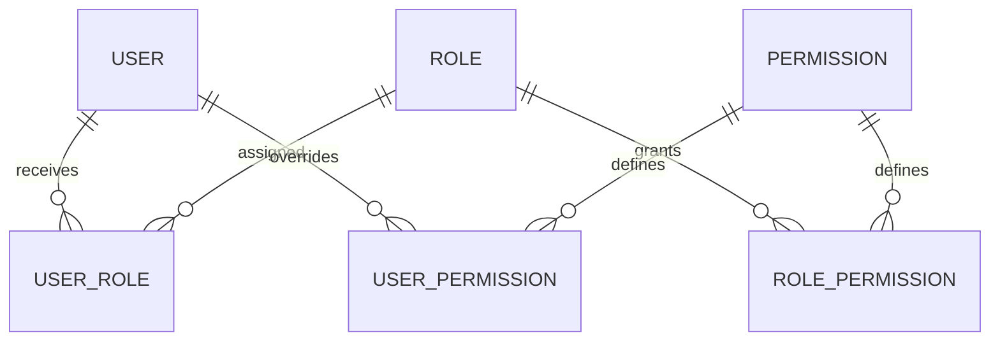

# Wine Words — Roles, Permissions and Dashboard Plan

Date: 6 October 2026  
Status: Detailed implementation plan; no application changes or deployment performed.

## Goal and deliverables

Introduce configurable roles and explicit permissions, preserve current record-access behavior, and add a complete UI dashboard to manage and explain access. Deliver database migrations, registry/seeds, a centralized resolver and policies, protected administration APIs, frontend capability integration, the dashboard, meaningful tests and rollout documentation. Keep each project independent.

This document is self-contained. Repository observations come from the review in this conversation. Before implementation, recheck the current source, AGENTS.md and deployment conventions. Proposed endpoints/actions are specifications, not claims that they already exist.


## Architecture and design decisions

Implement role-based access control (RBAC) with resource policies. A Role is a named bundle; a Permission is an implemented action; a RolePermission grants that action over an allowed set of records. A UserRole assigns the bundle to a login principal. A UserPermission provides an explicit grant or denial for an individual user. Policies interpret ownership, assignment, organisation context and record visibility.

Keep authorization on User during this refactor. Wine Words currently uses User → UserRole → Role and User → Account. Account may delegate `can?` to the resolver for convenience. Do not introduce competing AccountRole and UserRole tables. Identity changes and permission changes must be independent.

Use stable lowercase keys, such as `reviewer` and `article_projects.update`, separately from display names. Role names can change without changing behavior. Permission keys and supported scopes are maintained in application code and seeded into the database. Dashboard administrators assemble roles from these supported actions; creating a permission row alone cannot implement an action.

Start with role grants only, with explicit grant/deny exceptions on users. Multiple roles contribute a union of allowed records. Avoid role inheritance and role-level denies initially. Do not derive editorial authority from subscription names.



## Database specification

Wine Words uses global assignments initially. Omit organisation_id from new Wine Words authorization tables, constrain scope_kind to global, and use ordinary unique indexes on user/role and user/action/effect/access_scope. Organisation-specific requirements elsewhere in the generic contract are inactive for this project. Do not add an Organisation foreign key or tenancy model.

All new tables use timestamps and real foreign keys. Validate allowed values at both the model and database levels. Use database unique indexes, not only Rails uniqueness validators.

| Table | Columns and constraints | Notes |
| --- | --- | --- |
| roles | Existing id/name; add unique non-null key, description, system boolean, archived_at, lock_version | Backfill keys before setting NOT NULL. Protect system roles against deletion and key changes. |
| permissions | id, unique non-null key, name, description, resource, action, timestamps | Resource/action are grouping metadata; key is authoritative. Supported access scopes come from the code registry. |
| role_permissions | role_id, permission_id, access_scope, timestamps | Unique (role_id, permission_id, access_scope). Scope defaults must be explicit, never silently `all`. |
| user_roles | Existing user_id/role_id; add scope_kind, optional organisation_id where supported by the registry, granted_by_user_id, expires_at | Assignment context is separate from a grant's access_scope. Keep existing global assignments on upgrade. |
| user_permissions | user_id, permission_id, effect, access_scope, scope_kind, optional organisation_id where supported by the registry, reason, granted_by_user_id, expires_at, lock_version | Effect: grant or deny. Require a reason for manual exceptions. |
| authorization_audit_events | actor_user_id, effective_user_id, operation, target_type/id, before_data, after_data, reason, request_id, created_at | Preserve audit history when target records are archived/deleted. Reuse an existing audit subsystem where suitable. |
| users | Add authorization_version integer, non-null, default 0 | Increment on direct assignment and exception changes. |
| authorization configuration | A singleton configuration revision or equivalent durable revision | Increment on shared role/permission changes for cache invalidation. |

For scoped assignments, `scope_kind=global` requires organisation_id NULL; `scope_kind=organisation` requires a valid organisation_id. Use separate partial unique indexes for global and organisation rows: ordinary PostgreSQL uniqueness permits duplicate NULL values. Apply equivalent uniqueness to overrides, including effect and access_scope, and resolve conflicting duplicate submissions in a transaction.

Prefer revoking an assignment by deleting its active row and auditing the removal; preserve historical changes in the audit log. Archiving a role removes its active authority and invalidates caches. Do not silently assign an archived role.

Role updates use optimistic locking. A dashboard submission carries the version read by the client; stale updates return 409. Audit and mutate authorization in the same transaction. Use a service rather than unrestricted nested attributes for role grants and assignment changes.

## Permission registry and grant scopes

Each registered permission declares its resource policy, supported scopes, supported assignment contexts, and whether it is restricted to global administrators. Reject unsupported combinations when configuring roles or overrides.

| access_scope | Meaning | Required implementation |
| --- | --- | --- |
| own | Records whose ownership matches the principal | Define ownership per model; do not guess from arbitrary column names. |
| assigned | Records explicitly assigned to the principal | Use the actual assignment relationship. |
| organisation | Records belonging to the assignment's authorised organisation | Require active membership/authority where the domain requires it. |
| coach_of_record | Coaching records linked to the principal's verified coach identity | Not used in this project; do not implement it. |
| all | All records authorized by that action and assignment context | An organisation-scoped assignment still limits `all` to that organisation. |

Not every permission supports every scope. Creation uses a proposed parent/context rather than a persisted record. Require the server to load and authorize an organisation or parent ID from the request. Never trust a frontend-supplied ownership or scope label.

Guest/public access is implemented through explicit public policy rules. An unauthenticated visitor is not a UserRole row. Registered free-account access is a separate state and can retain existing role names during migration.

## Authorization resolver and policies

Expose a consistent service API:

```ruby
Authorization.allowed?(user, 'article_projects.update', record: project)
Authorization.allowed?(user, 'article_projects.create')
Authorization.scope(user, 'article_projects.read', ArticleProject.all)
Authorization.explain(user, 'article_projects.update', record: project)
```

These examples use Wine Words permission keys. Validate create access before assigning the current user as project owner.

Evaluation order:

1. Resolve the effective authenticated user and reject unavailable/suspended principals under existing authentication rules.
2. Reject unregistered permission keys and unsupported context combinations.
3. A protected global Admin bypasses permission denials and record authorization boundaries. Business validations, valid lifecycle transitions and database constraints still apply.
4. Collect active assignments and unexpired overrides applicable to the request context.
5. If a denial's scope matches this action and record, deny. A denial over own records does not deny unrelated records; an organisation denial does not deny another organisation.
6. Otherwise, require an applicable user grant or role grant whose access scope matches the record/context.
7. Enforce mandatory visibility and relationship constraints defined for that action. Do not let an override create cross-organisation access unless that action explicitly supports a global grant.
8. Deny by default.

Create a policy per resource family and query scopes equivalent to individual record decisions. Apply SQL filters before pagination, counts, exports, searches and lookups. Never fetch every record and hide unauthorized results in React. Ensure nested association writes and bulk operations authorize every affected relationship.

During impersonation, ordinary application requests use the effective user's authority. Only designated impersonation/admin control endpoints evaluate the real actor. Record both in audits. Never combine the real admin's roles with the impersonated user's capabilities.

Protect the global Admin role and assignments through dedicated global-admin-only services. Generic custom-role editing cannot create the Admin bypass. Keep self-lockout safeguards; block removal of the final usable global admin under a transaction/lock that prevents concurrent removals. Initially reserve role management, permission exceptions and role assignments to global Admin. Organisation delegation can be added later with an explicit ceiling: a manager can grant only approved roles within their organisation and cannot edit global roles.

## API contract

Add endpoints under the application's existing authenticated API namespace. Route names below are proposed; inspect existing routes before implementation and avoid collisions.

| Endpoint | Purpose |
| --- | --- |
| GET /authorization/me | Effective principal, role assignments, action summaries, authorization revision |
| GET /admin/permissions | Read-only registry, descriptions, supported scopes and restrictions |
| GET/POST /admin/roles | List roles/create a custom role |
| GET/PATCH /admin/roles/:id | Read/update role metadata and complete grant set atomically |
| POST /admin/roles/:id/archive | Archive a custom role with affected-user summary |
| GET /admin/users/:id/authorization | Assignments, overrides and effective summary |
| POST /admin/users/:id/role_assignments | Assign a permitted role/context |
| DELETE /admin/users/:id/role_assignments/:assignment_id | Revoke an assignment scoped to that user |
| POST/PATCH/DELETE /admin/users/:id/permission_overrides[/:override_id] | Manage user exceptions |
| POST /admin/authorization/explain | Explain an action against an existing record or proposed context |
| GET /admin/authorization/audit_events | Filterable paginated history |
| GET /authorization/me/explanation | Sanitized explanation of the current user's access |

Use existing route conventions rather than forcing both projects to share identical URLs. Keep request and response shapes equivalent where practical.

Return action summaries as scope summaries, not misleading universal booleans:

```json
{
  "authorization_revision": "configuration:7/user:12",
  "capabilities": {
    "article_projects.create": {"available": true},
    "article_projects.update": {"available": true, "scopes": ["own"]}
  }
}
```

Return record-specific `permissions` booleans from detail/list serializers where the UI needs them. Capability `available=true` only means the user can perform the action in some context. It never proves access to every record.

Use 401 for unauthenticated protected endpoints; 403 for known forbidden actions; 404 where exposing a private record's existence would leak information; 409 for stale changes. Validation failures use the existing API error convention. Explain endpoints must independently authorize the target record and selected user, and must not leak private profile/email data.

## Permissions UI dashboard

Add Settings → Access & Permissions, visible only when the backend grants dashboard access. The dashboard has six tabs. A personal read-only “My access” view is available to signed-in users with safe explanations.

### Overview

Show active/custom roles, assigned users, scoped assignments where applicable, unexpired exceptions, and recent changes. Counts are computed on the server under the same authorization rules as the lists. Include shortcuts to create a role, inspect a user and review expiring exceptions. Do not display fabricated analytics or hardcoded totals.

### Roles and permission matrix

Left pane: searchable role list with system/custom badges, archived toggle and assigned-user counts. Main pane: role name/description and a permissions matrix grouped by domain. Each action has a descriptive label, grant switch and supported scope selector. Allow multiple scopes when the policy supports them. Provide expand/collapse, filter granted permissions, search, and “copy role” to create an independent custom role without inheritance.

The UI displays stable permission keys as optional technical detail, not primary labels. Explain sensitive actions such as publication, private assessment access and role administration. The Admin role shows its protected bypass explicitly instead of pretending its authority comes only from checked boxes.

Saving shows a before/after diff and number of affected users, requests a reason for sensitive changes, and applies the complete change atomically. Unsaved edits trigger a navigation warning. A stale save shows a 409 reload/review flow. Archive displays impact and never archives a protected system role. This concrete UI confirmation is part of the product, not a request to stop implementation.

### User access

Search users using existing protected user-search endpoints. Selecting a user shows:

- Assigned roles with global/organisation context, expiry and grantor.
- An effective-permission summary explaining grant sources.
- Explicit exceptions in a separate section, with expiry and reason.
- Read-only identity/profile and subscription information as context.
- Links to audit events and the access simulator.

Adding a role requires a scope supported by that role's grants. Avoid issuing organisation assignments for roles that contain global-only actions. Removing a role previews lost access but does not claim a loss when another role still grants it. The UI explains that overrides can change the effective result.

### User exceptions

Grant/deny form: action, supported access scope, optional organisation context, expiry, reason. Mark denials prominently and show inherited grants affected. Preview the resulting decision with the resolver. “Remove exception” restores normal evaluation; it does not necessarily grant access. Restrict broad grants and administrative overrides to global Admin.

### Access simulator

Select a user, action, authorized record or create-context and run a read-only evaluation. Show allow/deny, effective principal, matching grants, applicable denials, relevant relationships and final decision. Clearly distinguish no grant, expired grant, out-of-scope record and business validation. Do not allow simulation to mutate assignments or resources. Limit record pickers and explanations to data the inspecting administrator is permitted to see.

### Audit history

Paginated table: time, actor, effective user during impersonation, operation, target, context, before/after diff and reason. Filter by user, role, action, date and organisation where supported by the registry. Read-only through this dashboard. Exports require explicit permission and use the same scope filtering as the list.

### My access

Display the user's roles and safe plain-language descriptions, such as “You can edit projects you created.” Explain restricted actions without revealing other users' private data or internal audit details. Do not allow self-assignment, self-approval or modification of permissions from this page.

### UX and accessibility acceptance

Support loading, empty, forbidden, error and stale-state screens; keyboard navigation; labeled controls; focus management for dialogs; screen-reader descriptions for matrix cells; responsive layouts with action cards on narrow screens. Disable save until changes exist and validation passes. API errors must preserve unsaved form values. Hide controls using current capabilities and record decisions, and independently enforce every operation on the server.

## Frontend integration

Replace role-name allowlists and scattered `roles.includes(...)` authorization checks with capability helpers for navigation/create actions and server-supplied record permissions for edit/delete/publish actions. Keep role names for display only. Include permission catalog and dashboard DTOs in the project's existing types/services folders.

Refresh authorization on login, logout, impersonation start/stop, role changes and override changes. Use the server's revision to invalidate UI state. A stale UI may briefly display a button; the server must still deny the request immediately after revocation. Do not treat Wine Words JWT role claims or localStorage snapshots as current authority.

## Performance, auditing and operations

Batch-load grants and assignments per request. Do not run an `exists?` query for each matrix cell or each serialized record. Prefer precomputed request context and policy scopes; test query growth with larger lists. Shared cache keys include configuration revision and user revision. Expiry must be honored even without a revision change: set cache lifetime no later than the nearest grant expiry or avoid caching those decisions.

Record successful administrative changes atomically; log denied sensitive administrative attempts using the existing security/audit facilities. Avoid logging private assessment content, comment bodies, passwords or tokens. Permission summaries cannot be cached across users without a user/context-specific key.

## Migration and rollout

1. Inspect current schema/routes/tests and produce a permission inventory with old decision rules and intended equivalent new policies.
2. Add tables/columns with reversible structural migrations; backfill keys and assignment contexts before tightening constraints.
3. Seed the registry and system role grants idempotently. Do not reset administrator customization on every deployment.
4. Backfill existing assignments without creating new users/accounts or granting additional global access.
5. Implement the resolver and policies; compare existing and new results in tests and optionally a bounded read-only shadow evaluation in staging. Legacy rules remain authoritative until that feature's cutover.
6. Add the protected dashboard and capability API. Dashboard editing remains disabled until the associated feature uses new enforcement, so a displayed revocation cannot be silently ignored by old code.
7. Migrate one resource family at a time: backend enforcement, SQL scopes, serializers and frontend controls together.
8. Test and stage with representative users; then cut over remaining checks and remove obsolete helpers once unused.
9. Enable custom-role editing and user exceptions after complete enforcement and revocation checks pass.

Keep a resource cutover checklist. Never run legacy OR new authorization in production: that combination can undo a denial. Rollback after new exceptions/custom roles are active must preserve effective restrictions, rather than reverting to old role-name checks. Prefer rolling back the UI or deployment while keeping the working new resolver; rehearse a compatible rollback release.

## Validation and release gates

Use the existing RSpec and frontend test frameworks. Required cases:

- Multiple roles union grants; no grant defaults to deny.
- Applicable explicit deny wins; unrelated deny scope does not spread.
- Protected global Admin bypasses permission denials; ordinary custom roles cannot obtain that bypass.
- Ownership/assignment checks and query scopes agree, including pagination, counts, exports and lookups.
- Unknown action/scope and client-forged context fail closed.
- Expired/revoked roles lose API access immediately; role edits invalidate shared caches.
- Nested writes and bulk mutations reject unauthorized records with the documented atomic behavior.
- Concurrent changes return 409; concurrent final-admin removals cannot lock out the platform.
- Impersonation uses effective-user rules and records the real actor.
- Role/override changes produce atomic audit events; dashboard operations cannot be called directly by non-admin users.
- Dashboard matrix, assignment/exception forms, simulator and history pass component tests and a representative browser workflow.
- Existing publication, membership, ownership, subscription and private-visibility behavior remains unchanged unless a separately approved product change is documented.

Run repository-prescribed lint/type checks and relevant backend/frontend suites. Record commands, results and unresolved issues in the implementation PR. This document is an implementation plan; it does not claim implementation tests have been run.

## AI implementation prompts: shared phases

Run prompts one phase at a time in the appropriate repository pair. Replace project-specific references with the sections below. Each prompt must finish with a change summary, verification commands/results and remaining risks. Do not deploy, alter production data, merge or rewrite unrelated identity/subscription models.

### Prompt 1 — Inventory and behavioral contract

```text
Inspect this project's Rails API and React frontend, including AGENTS.md, schema,
models, controllers, authorization concerns, serializers, auth/session payloads,
role-management routes, tests and frontend role helpers. Use this plan as the
intended architecture. Produce a permission inventory mapping each existing
check to an action, grant scope, assignment context and policy/query scope.
Identify all public, own, assigned, organisation and lifecycle exceptions.
Document current behavior and any mismatch with this plan; preserve current
behavior unless the plan explicitly changes it. Do not edit production or
implement the refactor yet. Identify the repository's required verification.
```

### Prompt 2 — Schema, registry and backfill

```text
Implement the schema, permission registry, validations and idempotent system-role
seeds in this plan using this project's conventions. Preserve User -> UserRole
-> Role and User -> Account. Backfill stable role keys and existing assignments
before applying NOT NULL/check constraints. Enforce uniqueness correctly for
nullable global scope contexts. Protect system-role keys and the global Admin
bypass. Do not grant wider access during backfill or overwrite customized roles
on seed reruns. Add migration/seed tests where they verify meaningful behavior.
Provide safe staging migration and rollback instructions.
```

### Prompt 3 — Resolver, policies and revocation

```text
Implement Authorization.allowed?, scope and explain with registry validation,
effective-user impersonation, protected global Admin bypass, applicable user
denials, union of applicable grants and resource policies. Define create-context
checks and SQL query scopes. Make scoped denials apply only to matching records.
Add revision-based invalidation and honor expirations. Test isolation, unknown
keys, multiple roles, overrides, revocation, query scope parity and impersonation.
Keep legacy checks authoritative until a resource's coordinated cutover.
```

### Prompt 4 — Administration API

```text
Implement protected role/catalog, user-assignment, override, explain and audit
endpoints following existing routes and error conventions. Validate every
permission/scope/context combination through the registry. Role metadata and
complete grant-set changes are atomic and use optimistic locking. Guard protected
Admin assignments, self-lockout and concurrent removal of the final usable admin.
Audit real/effective actors and before/after values. Prevent privilege escalation,
private-record leakage and cross-user nested assignment mutation. Add request tests.
```

### Prompt 5 — Permissions dashboard

```text
Build Settings -> Access & Permissions with Overview, Roles & Matrix, User Access,
Exceptions, Access Simulator and Audit History tabs, plus a safe read-only My Access
page. Use real APIs and the UI requirements in this plan. Implement domain grouping,
scope selectors, role copy/archive, impact previews, change diffs, reasons, expiry,
409 conflict recovery, loading/error/empty/forbidden states and accessibility.
Show protected Admin bypass clearly. Preserve form values on errors. Do not add
arbitrary permission-key creation or executable policy conditions. Keep editing
disabled for features not yet migrated to new backend enforcement. Test core flows.
```

### Prompt 6 — Coordinated feature cutover

```text
Migrate one resource family from the inventory to the new resolver, policies and
SQL scopes. Update controllers, service entry points, nested mutations, serializers,
search/count/export/lookup endpoints and React controls together. Preserve current
public/private visibility, ownership, assignment and lifecycle behavior. Use record
permission booleans for row actions and capability summaries for navigation/create.
Do not authorize via JWT role snapshots or frontend role names. Verify parity,
negative cases and immediate revocation before marking this family complete.
```

### Prompt 7 — Release verification

```text
Complete the validation matrix and resource cutover checklist in this plan. Run
required repository checks and relevant Rails/frontend/browser tests. Verify role
changes, overrides, expiration, impersonation and scoped list behavior end to end.
Remove unused role-name authorization helpers only after all callers migrate.
Document migration, seed behavior, cache invalidation, support troubleshooting and
a compatible rollback that preserves active denials. Prepare a reviewable PR;
do not deploy, merge or change production accounts.
```

## Wine Words: repository evidence and boundaries

Reviewed API snapshot: `6282b71d26c062e43640dc0bdec71b63daa6bfdc`, retrieved 6 October 2026. Recheck the current branch before implementation; these observations do not confirm deployed state.

- API: https://github.com/romalopes/wine_words_api
- Frontend: https://github.com/romalopes/wine_words_front_end
- Local development layout: `my_projects/wine_words/wine_words_api` and `my_projects/wine_words/wine_words_frontend`.
- `app/models/role.rb`: string-backed Rails enum for Admin/Editor/Reviewer/Reader/Guest; replace the enum with stable keys and ordinary records to allow custom roles.
- `app/models/user.rb`: role predicates, catalogue_manager?, wine_manager?, commenter?, comment_moderator?; subscription-driven Guest/Reader base role changes.
- `app/services/comments/permission.rb`: participation versus moderation, author edit/delete, soft-deleted comment restrictions and effective-user impersonation.
- `app/controllers/concerns/article_project_authorizable.rb`: managers see all projects; others see own; wine managers can create; owner/manager can update/delete.
- `app/controllers/concerns/wine_package_authorizable.rb`: managers see all packages; others see assigned or recorded packages; management depends on assigned reviewer or manager.
- `app/controllers/api/v1/users_controller.rb`: role assignment, subscription assignment and self-admin guard.
- `app/models/account.rb`: account contact data; no Person refactor is required.
- Frontend: `src/constants/roles.ts`, `src/contexts/AuthContext.tsx`, `src/services/accountApi.ts`; direct role helpers across components.

## Wine Words: initial permission map

Validate every entry against current controllers before enforcing. Seed migration grants to preserve actual current behavior; requested future behavior changes should be explicit.

| Resource | Proposed actions | Baseline grant/rule |
| --- | --- | --- |
| wines, vintages, producers and catalogue reference data | read, create, update, delete | Public reads follow existing visibility; Reviewer/Editor/Admin management retains the specific resource's current restrictions. Do not broaden narrower delete checks. |
| reviews | read, create, update, delete, publish | Preserve authorship, editor/admin authority and publication rules found in controllers. |
| articles | read, create, update, delete, publish | Preserve draft visibility and authorship/editor rules; publishing is a distinct action. |
| article_projects | read, create, update, delete | Reviewer: create and own project access; Editor: all projects; Admin: protected bypass. |
| wine_packages | read, create, update, delete | Reviewer creation; assigned/recorded reads versus assigned management; Editor/Admin all as currently enforced. |
| shipment/logistics records | read, create, update, delete | Inherit authorization through the related authorized package, not independent unrestricted IDs. |
| comments | create, reply, read, update, delete, moderate | Explicit participation grants; authors retain valid edit/delete behavior; Editor/Admin moderation; deleted tombstones remain protected. |
| likes | create, delete | Own-user operation and authorized parent visibility; inspect actual existing implementation. |
| subscriptions | read, manage | Own safe billing reads; administrative changes require the dedicated protected action. |
| authorization | dashboard_read, roles_manage, roles_assign, overrides_manage, explain, audit_read | Global Admin initially. |

### Roles and seeded behavior

| Role | Initial responsibilities |
| --- | --- |
| Guest | Existing registered free-account baseline; no new implicit comment grant. |
| Reader | Reading entitlement behavior and explicit commenting permissions as currently supported. |
| Reviewer | Catalogue work, own article projects, assigned packages and commenting. |
| Editor | Editorial/catalogue oversight, all projects/packages where currently allowed, comment moderation. |
| Admin | Protected global administrative bypass and administrative controls. |

Removing Role.name enum requires updating enum mappings, seeds, `Role.names[...]`, role_names serialization, assignment code and tests in one compatible migration. Preserve display names while introducing lowercase keys. Do not assume calling enum-generated predicates remains valid.

### Subscriptions and access

During compatibility migration, keep existing subscription-driven Guest↔Reader changes while making them use stable role keys. Preserve privileged roles on paid/free transitions. Do not widen paid content visibility simply because a custom role has `articles.read`.

Longer-term design separates entitlements from editorial authority: subscription determines subscriber-content availability; roles determine action capability; policies determine record visibility. Implement that separation as a deliberate later phase after preserving existing behavior. A free Reviewer retains reviewer duties; cancellation never removes independently assigned Reviewer/Editor/Admin roles.

Reader participation defaults follow current behavior. Replace “any role other than Guest can comment” with explicit `comments.create` and `comments.reply` grants so future custom roles do not automatically obtain comment access.

### Own article projects

Seed Reviewer grants: `article_projects.create` and own-scoped read/update/delete. Editor grants all-scoped access. Preserve current role-loss ownership exceptions found in the existing policy: an owner may currently retain read/update/delete even after Reviewer is removed. If replacing that behavior with explicit grants, model a clearly documented relationship-derived owner grant that can be overridden by user deny; do not silently revoke it in the migration. Any product decision to remove ownership-only rights should be separately reviewed.

Validate linked articles/reviews and nested records against their own policies. Updating an owned project does not grant access to somebody else's private review or article. Authorize lookup endpoints and nested association IDs, and retain lock_version concurrency protection.

### Wine package access

Keep read and write scope distinct. Current non-manager reads include reviewer_id or created_by_id; update/delete authority must match current endpoint behavior, with management primarily assigned reviewer or manager. A Reader assigned a package can receive applicable relationship-derived package access even without Reviewer role. Do not grant permission over all packages merely because the person is a wine manager.

If relationship-derived access is retained, feed it through the same centralized resolver as ordinary grants so explicit denial remains meaningful. Registry and explanation output should name the assignment/ownership source. Shipment and tracking mutations authorize through the accessible package.

### Comments

Separate participation, ownership edits and moderation. Authors may currently edit/delete their own active comments even if their participation role is later removed; preserve this as an explicit policy/relationship grant during migration and document it in explanations. Deleted comments remain noneditable under existing business rules. An explicit user denial must still be able to block the corresponding action. A comments.moderate grant does not grant access to private commentable resources unless the associated visibility policy allows it.

## Wine Words: dashboard integration

Add Settings → Access & Permissions in the existing navigation. Matrix groups: Catalogue, Reviews & Articles, Article Projects, Wine Packages & Logistics, Comments & Likes, Subscription Administration, Platform Administration.

User access includes role assignments, protected base-role status and a read-only subscription summary. Do not edit subscription state inside the permission matrix. Label base-role changes as subscription-managed while compatibility synchronization remains active; use the designated subscription workflow to change them.

Organisation-scoped assignments are not needed for the current Wine Words model. Keep assignments global and reject unsupported organisation context rather than introducing unused tenancy tables. Support own and assigned grant scopes through policies.

Simulator presets:

| Scenario | Expected result |
| --- | --- |
| Reviewer edits own article project | Allow. |
| Reviewer edits another reviewer's project | Deny. |
| Editor edits another reviewer's project | Allow under current all-project authority. |
| User recorded a package but is not its reviewer | Read may be allowed; management follows actual current assignment rules. |
| Reader is assigned a package | Preserve assignment-derived access without promoting to Reviewer. |
| Custom role has no comments.create grant | Cannot participate even though its name is not Guest. |
| Reviewer subscription becomes free | Reviewer responsibilities remain. |
| Admin impersonates Guest | Ordinary requests use Guest permissions. |

Use the existing RSpec model/request suite and frontend test framework. Include role-enum removal compatibility, subscription callback behavior and JWT stale-role revocation in validation.

## Wine Words: AI prompts

### Wine prompt A — Dynamic role conversion

```text
In wine_words_api, replace the fixed Role.name enum with stable-key role records
without breaking assignments or role serialization. Inventory and migrate all
Role.names, enum predicates, role_names/JWT payload uses, seeds and tests. Backfill
Admin/Editor/Reviewer/Reader/Guest keys, retain display names and protected system
roles, and make seed reruns non-destructive. Preserve UserRole rows and subscription
callbacks. Add tests covering old payload compatibility and custom-role creation.
```

### Wine prompt B — Projects, packages and comments

```text
Migrate ArticleProjectAuthorizable, WinePackageAuthorizable and Comments::Permission
into the centralized authorization architecture. Preserve Reviewer own projects,
Editor all-project access, package assigned/recorded read versus assigned-write
rules, Reader package assignments and comment author/moderator distinctions.
Explicitly model current relationship-derived access, including after role loss,
so it appears in explanations and respects applicable user denials. Authorize
private linked records, nested writes and lookups. Retain soft-delete and optimistic
locking rules. Replace non-Guest comment inference with explicit participation grants.
```

### Wine prompt C — Dashboard and subscription compatibility

```text
Build the Wine Words permissions dashboard with domain matrix groups and global
role assignments. Add user exceptions, real effective-access explanations, project/
package/comment simulator presets and audit history. Show subscription-managed
base-role status separately from editorial roles. Preserve privileged roles across
Guest/Reader subscription transitions. Replace src/constants/roles.ts authorization
allowlists and component role checks with capabilities and server row decisions.
Treat JWT role claims as display/compatibility data, not current server authority.
Verify revocation, paid/free transitions, own versus other project and Reader-assigned
package behavior. Do not implement a new subscription/entitlement system in this phase.
```

## Wine Words completion checklist

- [ ] Fixed Role enum converted without breaking keys, serialization or callbacks.
- [ ] Reviewer owns project CRUD; Editor all-project oversight remains intact.
- [ ] Package recorded/assigned visibility and mutation authority remain distinct.
- [ ] Comment participation requires explicit grants; ownership and tombstones survive.
- [ ] Subscription changes preserve editorial roles and existing content access.
- [ ] Direct API revocation works even with an old JWT/frontend snapshot.
- [ ] Dashboard matrix, exceptions, simulator and history operate with real APIs.
- [ ] RSpec, frontend type/lint checks and representative browser workflows pass.
