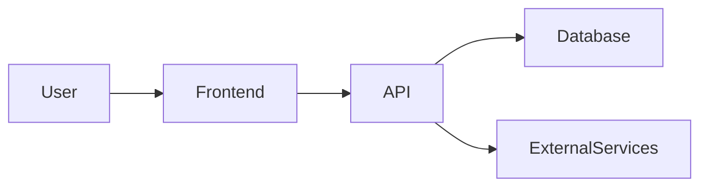

# Wine Words — README.md Documentation Plan

## Objective

Create professional, accurate, maintainable README documentation for the Wine Words project.

Wine Words consists of two applications:

- **Frontend:** `wine_words_front_end`
- **Backend API:** `wine_words_api`

The README documentation should allow a new developer to understand:

- What Wine Words is.
- What functionality currently exists.
- How the system is architected.
- How the frontend and backend communicate.
- How to install and run the project locally.
- How authentication and authorization work.
- How the database and domain model are structured.
- How to run tests and quality checks.
- How the applications are deployed.
- How to contribute to the project.
- What functionality is planned but not yet implemented.

The documentation must describe the **actual implementation**, not assumptions or historical plans.

---

# 1. Repository strategy

Create documentation appropriate for each repository.

## Frontend repository

`wine_words_front_end`

The README should primarily document:

- React application.
- Vite configuration.
- Frontend architecture.
- Pages and components.
- State management.
- API integration.
- Authentication from the frontend perspective.
- Environment variables.
- Local development.
- Testing.
- Production build.
- Vercel deployment.
- Frontend-specific development conventions.

## Backend repository

`wine_words_api`

The README should primarily document:

- Rails API.
- Domain model.
- Database.
- API architecture.
- Authentication.
- Authorization.
- API endpoints.
- Business logic.
- Background jobs, if any.
- Testing.
- Environment variables.
- Database migrations.
- Render deployment.
- Backend-specific development conventions.

## Optional project-level documentation

If appropriate, propose a third documentation location for shared project documentation.

This could eventually contain:

```text
docs/
  architecture.md
  domain-model.md
  api.md
  deployment.md
  roadmap.md
```

Do not create unnecessary documentation files now unless there is a clear reason.

---

# 2. Inspect the existing implementation first

Before writing the README, inspect the repository thoroughly.

Review all relevant sources of truth, including:

### Frontend

- `package.json`
- lockfile
- Vite configuration
- React configuration
- source directories
- routing
- API clients
- authentication code
- state management
- components
- pages
- hooks
- services
- tests
- linting
- formatting
- environment configuration
- build configuration

### Backend

- `Gemfile`
- `Gemfile.lock`
- Rails configuration
- routes
- models
- migrations
- schema
- controllers
- serializers
- services
- policies/authorization
- authentication
- jobs
- mailers
- tests
- seeds
- environment configuration

### Deployment and infrastructure

Inspect, where available:

- GitHub Actions.
- Render configuration.
- Vercel configuration.
- Docker configuration.
- Database configuration.
- Environment examples.
- CORS configuration.
- OAuth configuration.
- Build scripts.
- Deployment scripts.

Do not document something merely because it appears in an old document or previous product plan.

Verify it against the current code.

---

# 3. Identify the actual product functionality

Before writing the README, determine what Wine Words actually implements today.

Investigate the implementation of:

- Wines.
- Wine details.
- Reviews.
- Articles.
- Comments.
- Likes.
- Users.
- Authentication.
- Social authentication.
- Roles.
- Subscription plans.
- Reviewer functionality.
- Wine packages.
- Wine package images.
- Producer notifications.
- Wine arrival tracking.
- Review deadlines.
- Received wines.
- Search.
- Filtering.
- Administrative functionality.

For each feature, determine whether it is:

- Fully implemented.
- Partially implemented.
- Present in the backend but not frontend.
- Present in the frontend but not fully supported by the backend.
- Planned but not implemented.

Do not present planned functionality as implemented.

---

# 4. Project introduction

The README should start with a concise and professional introduction.

Include:

# Wine Words

Explain:

- What Wine Words is.
- The problem it solves.
- The type of wine content and workflows it supports.
- Who uses the platform.
- The current development status.

If a production application exists, include a link to it.

Also include links to:

- Frontend repository.
- Backend repository.
- Production application.
- API, if publicly accessible.

Only include URLs that can be verified.

---

# 5. Features

Create a clear feature overview.

Organize features into logical groups.

Possible categories include:

## Wine

- Wine catalogue.
- Wine details.
- Wine information and metadata.

## Reviews

- Wine reviews.
- Reviewer workflows.
- Review status.
- Review deadlines.

## Content

- Articles.
- Wine-related content.

## Social interaction

- Likes.
- Comments.
- User interactions.

## Wine packages

Document the actual implementation of:

- Wine packages.
- Package images.
- Producer notifications.
- Shipment information.
- Arrival tracking.
- Wines received.
- Review decisions.
- Review deadlines.

## Users

Document:

- Registration.
- Login.
- Social login.
- User profiles.
- Roles.
- Subscription plans.

Only include functionality that is verified.

---

# 6. Application architecture

Explain how the complete Wine Words system works.

At a minimum, document the relationship between:

```text
React Frontend
       |
       | HTTP/API
       v
Ruby on Rails API
       |
       v
PostgreSQL Database
```

Add external services only when confirmed.

For example:

- Authentication provider.
- OAuth providers.
- Image storage.
- Email provider.
- Payment provider.
- Hosting.
- Monitoring.

If useful, create a Mermaid architecture diagram.

Example structure:



Adapt this to the actual implementation.

---

# 7. Technology stack

Create a technology table.

Example:

| Layer | Technology | Purpose |
|---|---|---|
| Frontend | React | User interface |
| Build | Vite | Frontend build tooling |
| Backend | Ruby on Rails | API and business logic |
| Language | Ruby | Backend language |
| Database | PostgreSQL | Persistent data |
| Hosting | Vercel | Frontend deployment |
| Hosting | Render | API deployment |

Determine actual versions from:

- `package.json`
- lockfiles
- `Gemfile`
- `Gemfile.lock`
- `.ruby-version`
- Node configuration
- other project configuration

Do not guess versions.

---

# 8. Prerequisites

Document everything a new developer needs.

For example:

- Git.
- Ruby.
- Bundler.
- Rails.
- Node.js.
- npm.
- PostgreSQL or the required database tooling.
- Any required CLI tools.

Document supported versions where they can be verified.

---

# 9. Installation and local development

Provide complete, copyable setup instructions.

## Frontend

Document:

1. Clone repository.
2. Install Node dependencies.
3. Configure environment variables.
4. Configure API URL.
5. Start development server.
6. Access application.

Example commands should be generated from the actual project.

## Backend

Document:

1. Clone repository.
2. Install Ruby dependencies.
3. Configure environment variables.
4. Configure database.
5. Create database if required.
6. Run migrations.
7. Load seeds if appropriate.
8. Start Rails server.
9. Access API.

Do not document commands that have not been verified.

---

# 10. Environment variables

Document all environment variables actually used by the application.

Create a table:

| Variable | Application | Required | Purpose |
|---|---|---:|---|
| `VITE_API_BASE_URL` | Frontend | Yes | Rails API URL |
| `DATABASE_URL` | Backend | Yes | PostgreSQL connection |
| `RAILS_MASTER_KEY` | Backend | Depends | Rails credentials |
| `GOOGLE_CLIENT_ID` | Authentication | Depends | Google OAuth |
| `GOOGLE_CLIENT_SECRET` | Authentication | Depends | Google OAuth |

Replace the examples with the actual variables discovered in the code.

For every variable:

- Find where it is used.
- Explain its purpose.
- Identify whether it is required.
- Provide a safe example where appropriate.

Never include:

- Real passwords.
- API keys.
- OAuth secrets.
- Private keys.
- Tokens.
- Production credentials.

If an `.env.example` exists, document how to use it.

---

# 11. Project structure

Document the important parts of the codebase.

For the frontend, explain the actual structure, for example:

```text
src/
  components/
  pages/
  features/
  hooks/
  services/
  api/
  types/
```

For the backend, explain the actual structure, for example:

```text
app/
  controllers/
  models/
  services/
  serializers/
config/
db/
spec/
```

Use the real directory structure.

Explain what developers should normally put in each important directory.

Do not document every file.

---

# 12. Domain model

Explain the main Wine Words domain concepts.

Depending on the actual implementation, this may include:

- User.
- Role.
- Subscription.
- Wine.
- Review.
- Article.
- Comment.
- Like.
- WinePackage.
- WinePackageImage.
- Producer notification.

Explain important relationships.

For example:

```text
Wine
 ├── Reviews
 └── WinePackage references

Review
 └── Reviewer/User

WinePackage
 ├── WinePackageImages
 └── Wines
```

Only use relationships verified from the schema/models.

If useful, create a Mermaid ER diagram.

---

# 13. Authentication and authorization

Document the actual authentication architecture.

Explain:

- Registration.
- Login.
- Logout.
- Authentication mechanism.
- Social login providers.
- Token/session handling.
- Protected frontend routes.
- Protected API endpoints.
- User roles.
- Authorization rules.
- Administrative access.

Document the roles actually implemented.

If Wine Words currently contains roles such as:

- Guest.
- Reader.
- Reviewer.
- Super User.

verify that these are still the actual roles before documenting them.

Explain what each role can actually do.

Do not infer permissions from role names.

---

# 14. Subscription system

If the subscription system is implemented, document:

- Available plans.
- Plan identifiers.
- Entitlements.
- Upgrade/downgrade behavior.
- Payment provider.
- Webhook handling.
- Subscription state.
- Development/test mode.

Verify the actual implementation before documenting the plans.

If plans exist only as a future design, move them to the roadmap instead.

---

# 15. API documentation

For `wine_words_api`, document the actual API.

Start with:

- API base URL.
- API version.
- Authentication mechanism.

Then provide endpoint documentation.

Example:

| Resource | Method | Endpoint | Authentication |
|---|---|---|---|
| Wines | GET | `/api/v1/wines` | Public |
| Wine | GET | `/api/v1/wines/:id` | Public |
| Reviews | GET | `/api/v1/reviews` | ... |

Replace the examples with actual routes obtained from the Rails routing configuration.

For each important endpoint, document:

- HTTP method.
- Path.
- Purpose.
- Authentication requirement.
- Parameters.
- Request body.
- Response.
- Validation errors.
- Authorization requirements.

Do not document every internal endpoint if that would make the README unnecessarily large.

If OpenAPI/Swagger documentation exists, link to it instead.

---

# 16. Frontend API integration

For `wine_words_front_end`, document:

- API base URL configuration.
- API client implementation.
- Authentication integration.
- Error handling.
- Request handling.
- Environment configuration.

Explain how developers point the frontend at:

- Local API.
- Development API.
- Production API.

Use actual configuration names.

---

# 17. Database

Document:

- PostgreSQL.
- Database setup.
- Migrations.
- Seeds.
- Important database configuration.
- Development database.
- Production database at a high level.

Explain how to run:

```bash
rails db:create
rails db:migrate
rails db:seed
```

only if those commands are appropriate for the actual project.

Do not expose production database credentials.

---

# 18. Testing

Document the actual test setup.

Include:

- Backend test framework.
- Frontend test framework.
- Test commands.
- Integration tests.
- API tests.
- Component tests.
- Database test setup.

Also document:

- Linting.
- Formatting.
- Type checking.
- Build verification.

Use actual commands from the repository.

Clearly distinguish commands that were executed during documentation validation from commands merely documented.

---

# 19. CI/CD

If GitHub Actions or another CI system exists, document:

- What workflows exist.
- What they check.
- When they run.
- Test execution.
- Linting.
- Build checks.
- Database checks.
- Deployment workflows.
- Backup workflows, if relevant.

Do not expose GitHub secrets.

---

# 20. Deployment

Document the actual production deployment architecture.

For example, if verified:

```text
User
 |
 v
Vercel
React Frontend
 |
 v
Render
Rails API
 |
 v
PostgreSQL
```

Document:

- Frontend hosting.
- API hosting.
- Database hosting.
- Production URLs.
- Build commands.
- Environment variables.
- Database migrations.
- CORS.
- OAuth redirect URLs.
- Deployment process.
- Logs.
- Rollback considerations.

Only document verified deployment information.

---

# 21. Security and privacy

Include a concise security section.

Document relevant implemented mechanisms:

- Authentication.
- Authorization.
- Input validation.
- Secret management.
- CORS.
- Database access controls.
- API security.
- User data handling.
- Dependency security.

Do not include sensitive security configuration.

If there are known security limitations, document them honestly where appropriate.

---

# 22. Development workflow

Explain how developers are expected to work with the project.

Include:

- Branching.
- Commits.
- Pull requests.
- Code review.
- Testing before pull requests.
- Database migration practices.
- Frontend/backend coordination.

Only document existing conventions as facts.

If there are no established conventions, describe them as suggested development practices rather than existing project rules.

---

# 23. Roadmap

Add a roadmap section only when useful.

Clearly separate:

### Implemented

Functionality currently available.

### In progress

Functionality actively being developed.

### Planned

Future functionality that has been discussed but is not currently implemented.

### Known limitations

Important current limitations.

Do not turn previous conversations, ideas, or product plans into claims that functionality exists.

---

# 24. Contributing

Explain how another developer can contribute.

Include:

1. Fork/clone process if applicable.
2. Local setup.
3. Branch creation.
4. Implementation.
5. Tests.
6. Linting.
7. Pull request.
8. Code review.

Keep it consistent with the actual project workflow.

---

# 25. License

Inspect the repository for a license.

If one exists, document it.

If there is no license:

- Do not invent one.
- State that licensing has not yet been defined, if appropriate.

---

# 26. Links

Include useful verified links such as:

- Production application.
- Frontend GitHub repository.
- Backend GitHub repository.
- API documentation.
- Issue tracker.
- Deployment dashboard documentation, if appropriate.
- Related project documentation.

Do not include private administrative links unless the README is explicitly intended for internal use.

---

# 27. Documentation quality requirements

The final README must be:

- Professional.
- Clear.
- Concise where possible.
- Detailed where developers need detail.
- Easy to navigate.
- Accurate.
- Maintainable.
- Based on the current implementation.

Use:

- Tables.
- Code blocks.
- Mermaid diagrams where useful.
- Internal links for long documents.
- Clear headings.
- Short paragraphs.
- Examples.

Avoid:

- Marketing language.
- Unsupported claims.
- Excessive repetition.
- Outdated instructions.
- Secrets.
- Private credentials.
- Speculative architecture.
- Unimplemented features presented as completed.

---

# 28. Validation

Before finishing the README, validate it against the repository.

Check:

- Every installation command.
- Every environment variable.
- Technology versions.
- API endpoints.
- Authentication details.
- Roles.
- Database commands.
- Test commands.
- Build commands.
- Deployment information.
- Links.
- Mermaid syntax.
- Markdown formatting.

Where possible, execute the documented local commands to verify them.

Do not claim that a command was tested if it was not actually executed.

---

# 29. Do not modify application functionality

This task is documentation-only.

Do not modify:

- Application code.
- Database schema.
- Migrations.
- API behavior.
- Frontend behavior.
- Authentication.
- Deployment configuration.
- Environment variables.
- GitHub Actions.

Only modify documentation files necessary for the README task.

---

# 30. Final report

After creating/updating the README, report:

### README created/updated

Provide the exact file path.

### Documentation added

Summarize the major sections.

### Implementation verified

List the important areas that were checked against the code.

### Information not verified

Identify anything that could not be confirmed.

### Commands validated

List commands that were actually executed.

Clearly distinguish them from commands that were only documented.

### Documentation gaps

Identify any missing information that should be addressed later.

### Recommended future documentation

Suggest additional files only when they would provide genuine value, such as:

```text
CONTRIBUTING.md
CHANGELOG.md
docs/architecture.md
docs/domain-model.md
docs/api.md
docs/deployment.md
docs/roadmap.md
```

Do not create these additional files unless explicitly requested.