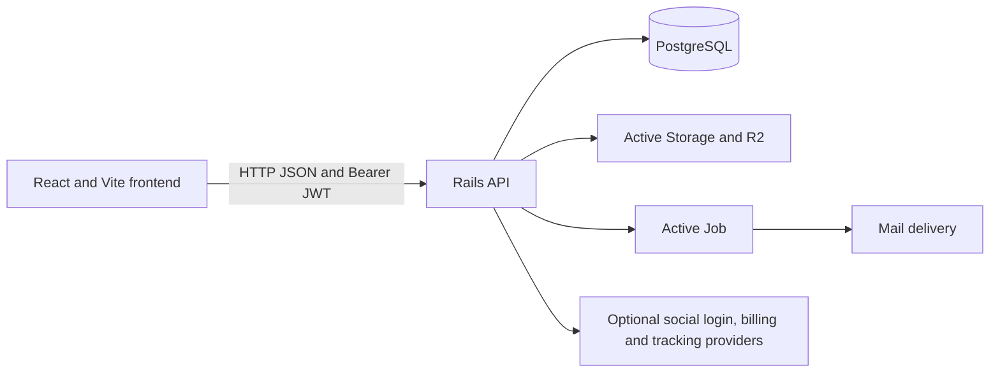
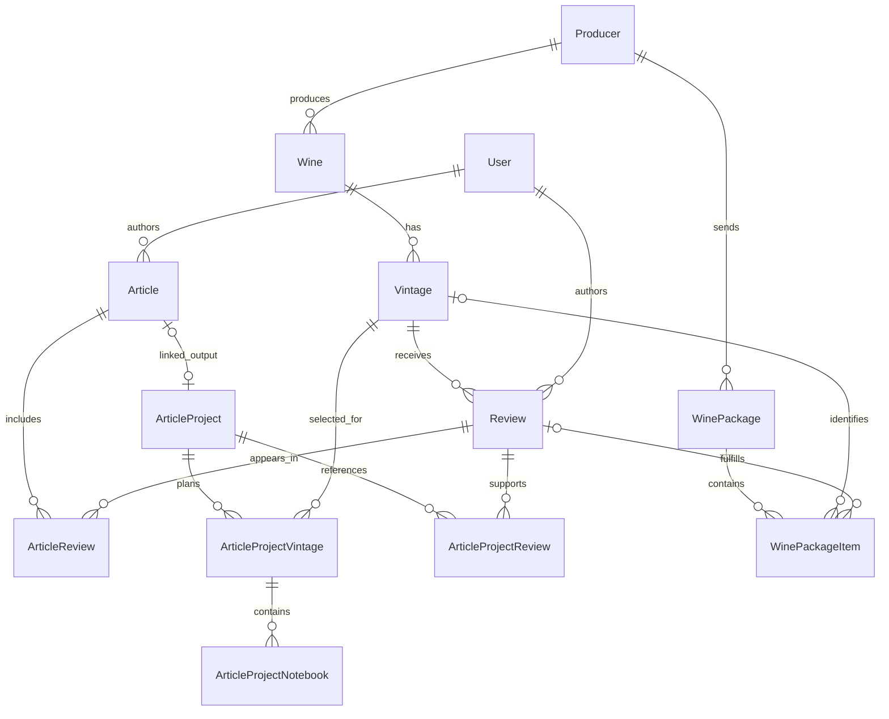

# Wine Words architecture

Wine Words combines a wine catalogue, editorial publishing, and a workflow for
receiving wines and producing reviews. These guides describe the current Rails
models and application behaviour, rather than proposed features.

## Read by domain

| Guide | Models and questions covered |
|---|---|
| [Wine catalogue and vintages](wine_vintages.md) | Producer, Wine, Vintage, geography, grapes, and taste profiles; what identifies the bottle being reviewed? |
| [Reviews](reviews.md) | Review authorship, vintage ownership, publication, article links, and package completion |
| [Articles](articles.md) | Article content, linked reviews, producers, vintages, and independent publication states |
| [Article projects](article_projects.md) | Planning, producer contact, sample receipt, notebooks, drafting, deadlines, and concurrency |
| [Wine packages](wine_packages.md) | Shipment intake, workflow transitions, review deadlines, tracking, and reminders |
| [Users and shared services](users_and_shared_services.md) | Accounts, identity, roles, subscriptions, images, comments, likes, search, and jobs |
| [System lifecycle](system_lifecycle.md) | An end-to-end example and which changes propagate between domains |

## Runtime architecture

The frontend lives in the sibling `wine_prediction/` application and is deployed
to Vercel (https://wine-words.vercel.app) and Cloudflare Workers
(https://wine-words.romalopes.workers.dev/). Rails lives here and is deployed as a Docker application on Render.
Rails also has server-rendered web controllers and views; their routes are separate
from the `/api/v1` JSON interface.

Controllers handle authentication, permissions, request parameters, and responses.
Models define associations, validation and callbacks. Services coordinate workflows
such as package arrival/completion; serializers define API payloads. PostgreSQL
stores domain records and search vectors. Uploaded objects live separately in
Active Storage's selected service, currently R2 in development and production.

## Core relationships

A **review evaluates one vintage**. A wine can have multiple years and each vintage
can have multiple reviews. An article includes existing reviews through join rows;
it does not own their lifetime. A project organises editorial work and optionally
links one article. A package organises logistics and review obligations. Projects
and packages share catalogue/review records but have no direct association.

The diagram shows domain relationships, not every reverse Rails association.
Database constraints and model callbacks both matter when deleting linked records;
see each domain guide before treating a relationship as a cascade.

## Code and operational references

- [Models](../../app/models/), [API controllers](../../app/controllers/api/v1/),
  [services](../../app/services/), and [database schema](../../db/schema.rb).
- [Local and deployment setup](../LOCAL_AND_DEPLOYMENT_SETUP.md): configuration,
  hosting, and the current async/Solid Queue runtime caveats.
- [Database seeds](../DATABASE_SEEDS.md) and [backup/restore](../DATABASE_BACKUP_AND_RESTORE.md).
- [Operational dashboards](../general_info.md).
- [Broader system reference](../../WINE_WORDS_README.md).

Implementation-plan documents elsewhere under `docs/` retain their historical
purpose. Use these domain guides alongside current code for implemented behaviour.
