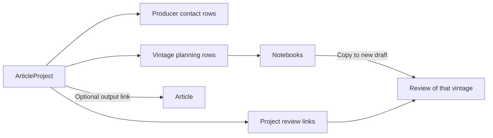

# Article projects

[Architecture index](architecture.md) · [Articles](articles.md) · [Reviews](reviews.md)

`ArticleProject` is an editorial planning workspace: who created the assignment,
which publication/editor it targets, its deadline and word target, the producers
contacted, vintages selected, tasting notebooks, and reviews collected. It may link
to one Article as its output, but can exist before that article is written.

## Models and relationships

| Model | Responsibility |
|---|---|
| `ArticleProject` | Name, creator, publication/editor details, deadline, project/drafting statuses, optional article, target word count |
| `ArticleProjectProducer` | Unique producer selection per project, contact/confirmation flags and notes |
| `ArticleProjectVintage` | Unique vintage selection per project, requested/received/selected/tasted flags, receipt date, condition and notes |
| `ArticleProjectNotebook` | Titled, ordered, editable content under a project-vintage row; multiple notebooks per selected vintage |
| `ArticleProjectReview` | Unique review selection per project |

Producer, vintage and review selections are independent collections. Selecting a
review does not automatically select its producer/vintage; selecting any of them
does not populate the linked article's associations. There is no direct
`ArticleProject`–`WinePackage` association.

## Planning lifecycle

`project_status` accepts:

`initiated`, `planning`, `pending_wines`, `researching`, `tasting`, `final_draft`,
`pending_editor_review`, `reviewed_by_editor`, `published`, `on_hold`, `cancelled`.

`drafting_status` separately accepts:

`not_initiated`, `initiated`, `in_progress`, `finished`.

A typical working order is planning → obtaining wines → research/tasting → final
draft → editor review → publication. **This is a working convention, not an
enforced transition matrix**: the model validates membership in the allowed lists,
not the sequence. Initial defaults are `initiated` and `not_initiated`.
Marking the project published does not publish its article or reviews.

A project is overdue when its deadline is before today and status is neither
`published` nor `cancelled`; `on_hold` projects can still be overdue. Actual word
count is computed from the linked article body using `ArticleProjectWordCounter`.
Without an article, actual count is nil; remaining words require both the target
and actual count, and can be negative if the article exceeds its target.

## Receipt, tasting, and notebooks

Confirming a producer request automatically marks that producer as contacted.
Vintage flags are planning facts rather than a sequential state machine.
Setting `received` fills a missing receipt date with today; clearing it clears the
date and resets condition to `not_assessed`. Future receipt dates are invalid,
and a date or assessed condition requires `received`.

Conditions are `not_assessed`, `good`, `damaged`, `leaking`, or `other`.
Notebook titles are required and trimmed; positions are nonnegative integers.
The notebook endpoint can create a draft review with its title/content, score 80,
and the selected vintage, then link it to the project. This is a copy, not live
synchronization or guaranteed one-time conversion; see [Reviews](reviews.md).

## Ownership and concurrent editing

The API allows catalogue managers to see/manage all projects; other users are
scoped to their own `created_by_id`. Creation and lookups require `wine_manager?`.
Linked article/review access is also checked server-side.

Project updates require `lock_version`; notebook updates and deletion require
the notebook's version. Stale writes return HTTP 409 and require reload/retry;
missing versions return 422. Project deletion does not currently require a client
version. The locking contract protects these endpoints, not every possible write
in the application.

## Deletion

Deleting a project destroys its producer/vintage/review joins and the notebooks
under its vintage joins. Shared producers, vintages, reviews, and the linked
article remain. Removing one selected vintage also destroys its notebooks.
Deleting the linked article nullifies the project's article link.

## Source

[ArticleProject](../../app/models/article_project.rb),
[project controller](../../app/controllers/api/v1/article_projects_controller.rb),
[notebook controller](../../app/controllers/api/v1/article_project_notebooks_controller.rb),
[authorization](../../app/controllers/concerns/article_project_authorizable.rb),
[word counter](../../app/services/article_project_word_counter.rb), [schema](../../db/schema.rb).
