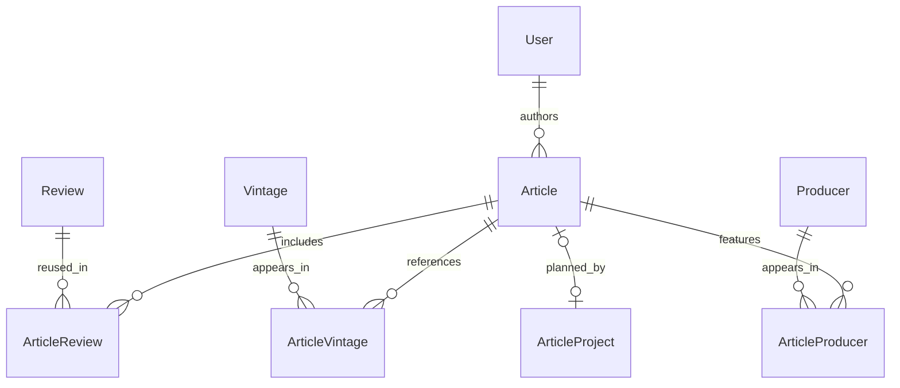

# Articles

[Architecture index](architecture.md) · [Reviews](reviews.md) · [Article projects](article_projects.md)

An `Article` is an authored piece of editorial content with a title, abstract,
body, publication status and optional images. It can combine several reviews
and also reference producers or vintages independently of those reviews.

## Relationships

`ArticleReview` makes articles and reviews many-to-many: one article can include
many reviews and one review can appear in many articles. Removing the join removes
that inclusion, not the review itself.

`ArticleVintage` lets an article reference a vintage without a review.
`Article#wines` traverses these direct vintage links; it is not automatically the
union of wines from linked reviews. `ArticleProducer` independently associates
producers. Tags and categories use `ArticleTag` and `ArticleCategory`; an optional
single `category` association also remains.

An article has at most one linked project, enforced by the unique index on
`article_projects.article_id`. Articles and projects can each exist without the
other. Linking a project does not copy its producer/vintage/review selections into
the article's own join tables.

## Two publication decisions

| Field | Controls |
|---|---|
| `Article.status` | Whether the article is draft or published |
| `Review.status` | Whether the review itself is draft or published |
| `ArticleReview.status` | Whether that review's link is draft or published within this article |

The intended rule is that an article link can be published only when the review
is published. Unpublishing a review demotes its published article links; republishing
it does not automatically restore them. Publishing an article does not publish
its linked reviews or update an ArticleProject's status.

Implementation detail to account for: `ArticleReview` validates the underlying
review and has demotion callbacks, but its `before_create` also unconditionally
sets link status to `published`. That callback order can override a new draft
link's status. Do not treat the intended rule as a database invariant.
`Article#published_reviews` filters **link status only**, while the API serializer
also exposes linked reviews and their link statuses. Consumers must respect the
appropriate visibility rules rather than assume every serialized link is public.

## Lifecycle

1. An author creates a draft with a title and body; slug generation supplies a
   unique URL identifier.
2. Add images, tags, categories, producers, direct vintages, and review links as
   needed. Existing reviews remain independently editable.
3. Publish the article through an authorized update. `draft` and `published` are
   the model's allowed values; `published_at` is separate content metadata.
4. Edit or return it to draft. Content edits update its PostgreSQL search vector.
5. Delete it when appropriate: article join rows and owned images/likes/comments
   are destroyed; the linked project's `article_id` is nullified. Shared reviews,
   producers and vintages survive.

The model's `visible_to` scope includes published articles and the author's own
articles. Endpoint permissions and serializers determine the actual response.

## Source

[Article](../../app/models/article.rb), [ArticleReview](../../app/models/article_review.rb),
[API controller](../../app/controllers/api/v1/articles_controller.rb),
[serializer](../../app/serializers/article_serializer.rb), [schema](../../db/schema.rb).
