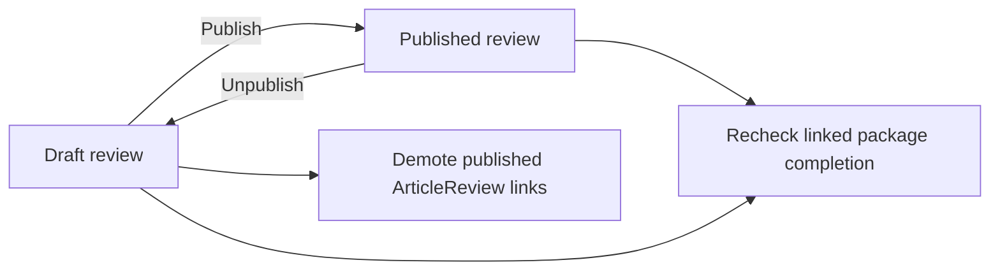

# Reviews

[Architecture index](architecture.md) · [Wine and Vintage](wine_vintages.md) · [Articles](articles.md)

A `Review` is one user's assessment of **one Vintage**. It does not belong directly
to Wine, Article, ArticleProject, or WinePackage. Those workflows reference the
same review through their own links.

## Relationships

| Relationship | Storage and meaning |
|---|---|
| Author | Required `Review.user_id` |
| Reviewed bottle/year | Required `Review.vintage_id`; wine is `review.vintage.wine` |
| Articles containing the review | `ArticleReview` joins, with a separate display/publication status per article |
| Projects using the review | `ArticleProjectReview` joins; planning membership does not publish anything |
| Package obligations fulfilled | Optional `WinePackageItem.review_id`; several items can reference a review |
| Presentation | Images, comments, likes, an optional category, and additional categories through `ReviewCategory` |

There is no one-review-per-vintage rule. Different reviewers, or repeated tasting
sessions, can produce separate reviews for the same vintage.

## Creating a review

Three paths converge on the normal model validations:

1. Create directly against an existing vintage, with an author and tasting details.
2. Create from a package item through `WinePackages::CreateReviewFromPackage`.
   The item must request a review, have a vintage, and have no linked review yet.
3. Create from a project notebook. The controller copies title/content, uses its
   project's selected vintage and the current user, assigns score `80` and status
   `draft`, then creates an `ArticleProjectReview` link in the same transaction.

Notebook conversion is a snapshot. Later notebook changes do not update the review,
and later review changes do not update the notebook. Despite the controller's
"only once" comment, the action does not store a conversion marker or reject a
second call; repeated calls can create additional reviews.

## Validation and publication lifecycle

Reviews require a title, unique generated slug, score from 0 to 100, and a status
of `draft` or `published`. An optional drinking window must start no earlier than
the vintage year; its end cannot precede its start, and an end requires a start.

The `visible_to` model scope includes published reviews and the viewer's own
reviews. Controllers apply additional permission checks; a model scope is not a
substitute for endpoint authorization.

On a status change, `Review` callbacks:

- Demote all published article links to `draft` when the review is unpublished.
- Re-evaluate packages whose items reference the review, potentially completing
  or reopening automatically completed packages.

Republishing the review does **not** automatically republish its article links.
Deliberately completed packages are not automatically reopened. Review publication
also does not change a project's planning status or publish an article.

## Deletion

The model nullifies linked package items' `review_id` and destroys its category
joins, images, likes and comments through associations/concerns. Article/project
review links have database foreign keys and no corresponding dependent cleanup
association on `Review`; those links may block deletion until explicitly removed.
Bulk nullification does not run item save callbacks, so do not assume review
deletion follows the same completion-reconciliation path as unpublishing.

## Source

[Review](../../app/models/review.rb), [ArticleReview](../../app/models/article_review.rb),
[notebook controller](../../app/controllers/api/v1/article_project_notebooks_controller.rb),
[package review service](../../app/services/wine_packages/create_review_from_package.rb),
[package completion](../../app/services/wine_packages/check_completion.rb).
