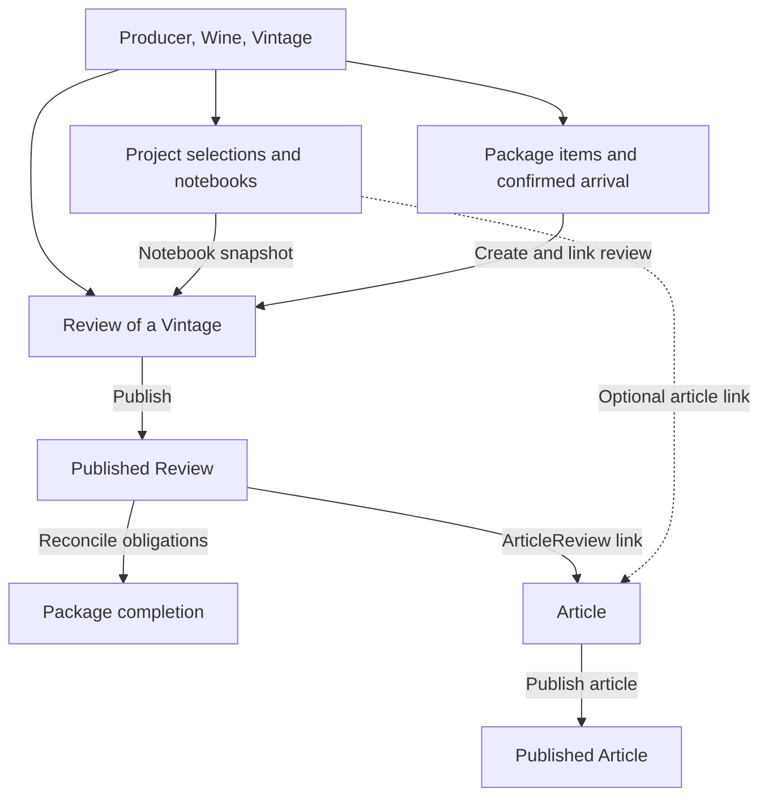

# System lifecycle

[Architecture index](architecture.md)

This walkthrough connects the domain guides. It is a typical editorial process,
not a mandatory sequence enforced across every model.

## From catalogue to publication

1. **Identify the wine.** Create or select a Producer, Wine and Vintage. For example,
   a producer's Shiraz 2022 and Shiraz 2023 are two vintages of one wine.
2. **Plan the story.** Create an ArticleProject with publication, editor, deadline,
   and optional word target. Select producers and vintages, record contact/receipt
   facts, and take notes in project-vintage notebooks.
3. **Receive samples if needed.** Record a WinePackage and its items. Items may be
   unmatched initially; review creation requires a resolved vintage. Confirm
   arrival explicitly, which starts the package's review deadline. A carrier's
   delivered status alone does not mark arrival.
4. **Taste and write reviews.** Create a Review for the selected Vintage, directly,
   from a package item, or by copying a project notebook. A notebook-created review
   joins the project; a package-created review links its item. These paths do not
   automatically create each other's links.
5. **Publish reviews.** A published review can satisfy package obligations and be
   included as published within an article. A draft does not fulfil a requested
   package review.
6. **Compose the article.** Create an Article, optionally link it as the project's
   output, and select its review/producer/vintage associations independently.
7. **Publish and finish planning.** Publish the Article and update project status
   deliberately. Completing the project, publishing content, and completing a
   package are different operations.

## What propagates automatically?

| Change | Automatic effect | Separate decision |
|---|---|---|
| Confirm producer request in a project | Marks its project-producer row contacted | Package creation/shipment |
| Mark a project vintage received | Defaults receipt date if missing | Mark a package arrived |
| Convert a notebook to a review | Creates a draft review and project-review join | Future synchronization, package linking, publication |
| Publish/unpublish a linked review | Rechecks package completion; unpublishing demotes published article links | Article/project publication |
| Finish all requested package reviews | May auto-complete an arrived/reviewing package | Project status |
| Unpublish a review in an auto-completed package | Can reopen that package | Deliberately completed packages stay completed |
| Publish an article | Changes article publication state | Project status and review/link statuses |
| Mark a project published | Changes project planning state | Article publication |

See [Articles](articles.md) for the current ArticleReview callback-order caveat.
There is no global transaction or state machine spanning all these domains.

## Revisions and removal

An article can reuse reviews across stories. Unlinking a review from one article
or project leaves the review available elsewhere. Editing a notebook after copying
it to a review leaves the existing review unchanged.

Deleting a project removes its planning joins and notebooks, preserving shared
content. Deleting an article removes its joins and detaches the project output
link. Deleting a wine attempts to destroy its vintages and reviews, but foreign
keys from other domains may block the operation. Use the domain-specific deletion
notes; bulk deletes and seeds can bypass callbacks or remove much more than the UI
operation suggests.

## Running the workflow

- [Catalogue and vintages](wine_vintages.md), [reviews](reviews.md),
  [articles](articles.md), [projects](article_projects.md), and
  [packages](wine_packages.md) describe the relevant models and code.
- [Local/deployment setup](../LOCAL_AND_DEPLOYMENT_SETUP.md) explains environment
  configuration, including storage, email, permissions-related setup and jobs.
- [Seed scripts](../DATABASE_SEEDS.md) explain sample data preparation and its risks.
