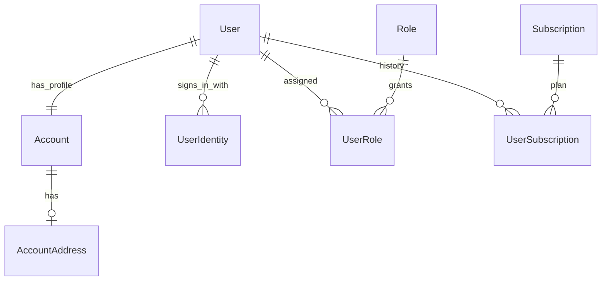

# Users and shared services

[Architecture index](architecture.md) · [System lifecycle](system_lifecycle.md)

## Identity and ownership

`User` is the authenticated application identity. `Account` is its profile, holding
names and other personal information; `AccountAddress` belongs to that profile.
The user model ensures an account exists and delegates name access to it.
An Account is not a producer business or a tenant that owns the wine catalogue.

`UserIdentity` associates a user with an external provider identity. The key is
`(provider, provider_uid)`, not email. Uniqueness constraints prevent the same
provider identity belonging to multiple users and multiple identities for the
same provider on one user. Password authentication uses Devise; API tokens use
Devise JWT with `JwtDenylist` for revocation.

Users author reviews and articles, create projects, and act as reviewers/actors
on packages. Those are distinct ownership roles. A producer does not currently
have a direct account/login association.

New-user callbacks assign a Guest role and the default subscription when available.
Role checks and resource ownership both matter; a login does not automatically
provide editorial or administrator access. Consult
[user/account identity](../user-account-identity.md) and
[social authentication setup](../social_authentication.md) for the detailed flows.

## Subscription lifecycle

`Subscription` defines a plan and links its feature catalogue through
`SubscriptionSubscriptionFeature`. `SubscriptionBillingPrice` stores provider
price mappings. A user's current plan reference is accompanied by
`UserSubscription` history; `SubscriptionChange`, `BillingCustomer` and
`BillingEvent` support change tracking and provider integration.

Applying a subscription through `User#apply_subscription!` updates the plan and
history and synchronizes the base access role (Guest for free, Reader for paid)
without removing privileged roles. Plan rank and monetary price are separate
values. Plans with assigned users or history cannot simply be hard-deleted;
`active` and `visible` flags support retirement from selection/display.

Subscription feature descriptions do not, by themselves, enforce access rules.
Check the relevant controller/policy and billing service before assuming a plan
label grants a capability. Provider configuration belongs in the
[setup guide](../LOCAL_AND_DEPLOYMENT_SETUP.md).

## Images, likes, and comments

| Concern | Data and lifecycle |
|---|---|
| Images | Wine, Producer, Review and Article include `Imageable`; polymorphic `Image` rows own Active Storage attachments. Producer also has a separate logo attachment. |
| Likes | Wine, Review and Article include `Likeable`; one user/target pair is unique, and a counter cache tracks totals. |
| Comments | Wine, Review and Article include `Commentable`; comments belong to a user and target, with one level of replies on that same target. |

Comment API removal uses soft deletion: `deleted_at` produces a tombstone and
also soft-deletes visible replies. Destroying the parent content uses dependent
association destruction instead. Images, likes and comments are owned by their
content target and are removed through its destroy callbacks.

Files are stored separately from database rows. A database restore alone does not
restore media objects; see [backup and restore](../DATABASE_BACKUP_AND_RESTORE.md).

## Search, audit, and background work

Articles and reviews maintain PostgreSQL weighted search vectors via
`TextSearchable`. Catalogue/profile changes use `SearchVectorDependent` to
refresh search data on affected content. Search indexing is derived state, not an
alternative owner of article or review data.

Mutation endpoints can record audit information through `Auditable`, `LogService`,
`Log` and `LogObject`. Logging does not replace domain validation or authorization.

Active Job handles work such as mail delivery. Both development and the effective
production configuration currently use `:async`; installed Solid Queue and
`config/recurring.yml` alone do not establish a running durable scheduler.
Package reminder and billing recurring jobs need a correctly configured worker
and scheduler to run automatically. See the
[runtime configuration caveats](../LOCAL_AND_DEPLOYMENT_SETUP.md#current-deployment-mismatches-to-resolve-deliberately).

## Source

[User](../../app/models/user.rb), [Account](../../app/models/account.rb),
[UserIdentity](../../app/models/user_identity.rb), [Subscription](../../app/models/subscription.rb),
[Comment](../../app/models/comment.rb), [shared concerns](../../app/models/concerns/),
[production configuration](../../config/environments/production.rb).
