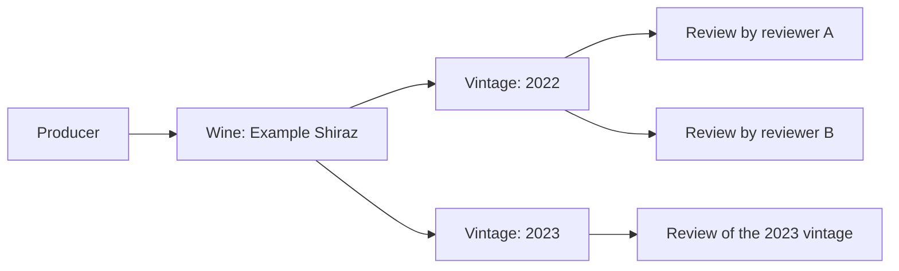

# Wine catalogue and vintages

[Architecture index](architecture.md) · [Reviews](reviews.md) · [Wine packages](wine_packages.md)

## Model responsibilities

| Model | Meaning and relationships |
|---|---|
| `Producer` | Winery or other producing business; belongs to a country, has an address and many wines, and links to regions and grapes |
| `Wine` | The named product, independent of a year; belongs to one producer and has many vintages |
| `Vintage` | A particular year of a wine; belongs to one wine and has many reviews |
| `Country` / `Region` | Geography; regions belong to countries and can form a parent/child hierarchy |
| `Grape` | Variety metadata; many-to-many links to wines and producers |
| `TasteParameter` | A taste dimension; `WineTasteParameter` associates it with a wine and its score |
| `WineProfile` | A reference taste profile with dimensions through `WineProfileTasteParameter` |

Wine categories use `WineCategory`, alongside an optional single `category`
association. Wine regions and grapes use `WineRegion` and `WineGrape`;
producer associations use `ProducerRegion` and `ProducerGrape`.

The review's foreign key is `vintage_id`, not `wine_id`. Displaying a wine's reviews
means following its vintages. A package line and a project's selected sample also
refer to a vintage when the catalogue identity is known.

## Creation and editing lifecycle

1. Create the country/region and producer. Producers require a name, country,
   valid email, and allowed producer type. Create callbacks supply default country
   and email values where appropriate.
2. Create the wine with its producer, colour, closure, alcohol percentage, and
   bottle volume. New records have model defaults; volume and closure are validated
   against the supported values.
3. Add vintage records with a year of at least 1900. `price_cents` stores money;
   the virtual `price` getter/setter converts to/from dollars.
4. Attach grape, region, category and taste data, then create reviews for the
   appropriate vintage. Nested wine writes can also create/update/delete vintages.

`Vintage#name` combines wine name and year. Its `slug` is computed from the wine's
slug and year. Do not assume year alone identifies a vintage, or that the model
validates uniqueness of `(wine_id, year)`; the current Vintage model does not.
These catalogue models have no draft/published workflow of their own.

Changing a producer's country removes old-country region links during validation;
selected regions must belong to the producer's country. Review search data depends
on catalogue names and years, so the models use `SearchVectorDependent` to refresh
affected review search vectors.

## Deletion and shared references

Producer destruction attempts to reassign its wines to the `Unknown Producer`
record. Wine destruction calls dependent destruction on vintages, and vintage
destruction calls it on reviews. Wine-specific join rows are also destroyed.
However, article/project and other foreign-key references can block a deletion;
these callbacks are not a guarantee that every connected graph can be deleted.

Removing a project's vintage selection is different from deleting the vintage:
it deletes the planning join and its notebooks, retaining the catalogue record.
Use the [seed guide](../DATABASE_SEEDS.md) before replacing catalogue data, because
some seed scripts delete grapes or wines before importing replacements.

## Source

[Wine](../../app/models/wine.rb), [Vintage](../../app/models/vintage.rb),
[Producer](../../app/models/producer.rb), [Region](../../app/models/region.rb),
[WineProfile](../../app/models/wine_profile.rb), [schema](../../db/schema.rb).
