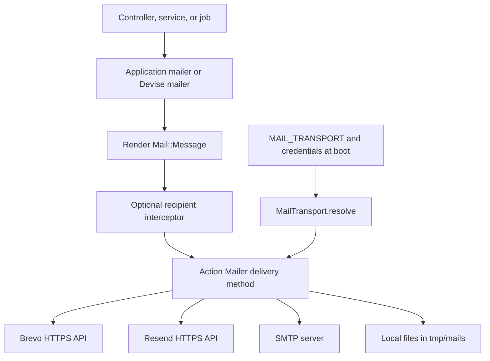

# Copying Wine Words email infrastructure into another Rails project

This guide explains how to reuse Wine Words' Action Mailer infrastructure with **Brevo, Resend, SMTP, or local file delivery**. The correct names are `lib/mail_transport.rb`, `MailTransport`, and `MAIL_TRANSPORT` (not `mail_tansport`). The target is another Rails application; a non-Rails application can reuse the selection rules and HTTP payload design but needs its own mail rendering and job integration.

## 1. Reference and implementation baseline

Reference repository: [Wine Words API on GitHub](https://github.com/romalopes/wine_words_api). The local checkout is named `wine_prediction_api`; its origin still uses the earlier repository name `romalopes/wine_prediction_api`.

This guide was prepared from the local implementation on 6 October 2026, at checkout HEAD `87ce86b6ec79c14b327b6a10de6adcb8fea83c1f`. GitHub links below use `main` for navigation and may change; inspect the chosen source revision before copying. The source declares Rails `~> 8.1.3` and Ruby `3.4.2`. Keep the target application's supported Ruby/Rails versions and verify compatibility rather than replacing its dependency files.

**Source caveat:** the inspected `config/environments/production.rb` contains unresolved merge-conflict markers and competing queue configurations. Do not copy that file wholesale. Use the clean integration snippets below and select the target application's queue explicitly. This document does not repair the source application.

## 2. How delivery works



Mailers build recipients, subject, text, HTML, and attachments. They do not call provider APIs. `deliver_now` performs delivery immediately; `deliver_later` queues an Active Job that renders and delivers the message. `MailSender` supplies sender defaults. `MailTransport` chooses one delivery method during application boot. Both HTTP adapters share `HttpMailDelivery` and accept a `Mail::Message` through `deliver!`.

Provider selection is independent of business features: password reset, email verification, and wine-package reminders use the same infrastructure. Their models, routes, tokens, and templates are separate application concerns.

## 3. Files to copy and files to adapt

Paths are relative to the backend repository and to the target Rails root.

| Source / GitHub reference | Target action | Responsibility |
| --- | --- | --- |
| [`lib/mail_transport.rb`](https://github.com/romalopes/wine_words_api/blob/main/lib/mail_transport.rb) | Copy | Transport override, automatic precedence, configuration warnings |
| [`lib/http_mail_delivery.rb`](https://github.com/romalopes/wine_words_api/blob/main/lib/http_mail_delivery.rb) | Copy | Body/address extraction, attachment encoding, HTTPS JSON requests, API error handling |
| [`lib/brevo_delivery.rb`](https://github.com/romalopes/wine_words_api/blob/main/lib/brevo_delivery.rb) | Copy | Brevo endpoint, authentication, payload, diagnostic hints |
| [`lib/resend_delivery.rb`](https://github.com/romalopes/wine_words_api/blob/main/lib/resend_delivery.rb) | Copy | Resend endpoint, authentication, payload, diagnostic hints |
| [`lib/mail_sender.rb`](https://github.com/romalopes/wine_words_api/blob/main/lib/mail_sender.rb) | Copy and change defaults | `MAIL_FROM` and `MAIL_REPLY_TO` lookup |
| [`config/application.rb`](https://github.com/romalopes/wine_words_api/blob/main/config/application.rb) | Merge only mail requires and initializer | Register adapters and apply selection after Action Mailer configuration |
| [`config/environments/development.rb`](https://github.com/romalopes/wine_words_api/blob/main/config/environments/development.rb) | Adapt mail settings | SMTP settings, delivery flags, URLs |
| `config/environments/production.rb` | Use clean example below | Production delivery, SMTP and URL configuration |
| [`config/environments/test.rb`](https://github.com/romalopes/wine_words_api/blob/main/config/environments/test.rb) | Preserve test delivery | In-memory mail and test jobs |
| [`app/mailers/application_mailer.rb`](https://github.com/romalopes/wine_words_api/blob/main/app/mailers/application_mailer.rb) | Adapt | Shared sender and layout |
| `app/views/layouts/mailer.html.erb`, `mailer.text.erb` | Copy or retain target layouts | Rendering wrappers |
| [`spec/lib`](https://github.com/romalopes/wine_words_api/tree/main/spec/lib) | Copy the four mail specs listed below | Selector, sender, and adapter regression coverage |

Optional integrations:

| Source | When needed |
| --- | --- |
| `app/mailers/custom_devise_mailer.rb`, `config/initializers/devise.rb`, `app/views/devise/mailer/` | Target already uses Devise; merge sender settings and adapt templates/links |
| `app/mailers/test_email_interceptor.rb`, `config/initializers/action_mailer.rb`, `app/models/app_setting.rb` | Target needs database-controlled redirection to a test inbox |
| `app/mailers/email_verifications_mailer.rb`, its views, `app/services/email_verification_service.rb`, `config/initializers/email_verification.rb` | Target also needs verification business logic; additional user fields, routes, and controllers are required |
| `app/mailers/wine_packages_mailer.rb` and its views | Reference for a domain-specific mailer, not a generic dependency |

Do not copy real `.env` files, Wine Words sender addresses, the entire `Gemfile`, database schema, or unrelated domain models. The core transport files need no database tables. Rails provides Action Mailer, Mail, and Active Support; the HTTP helper uses Ruby standard libraries (`net/http`, `json`, `uri`, `base64`). No Brevo or Resend SDK is required. The adapters use Active Support helpers such as `blank?` and `present?`, so they are not standalone Ruby classes without those dependencies.

## 4. Transport selection: exact behavior

| `MAIL_TRANSPORT` | Required configuration | Result |
| --- | --- | --- |
| `brevo` | Nonblank `BREVO_API_KEY` | `:brevo` |
| `resend` | Nonblank `RESEND_API_KEY` | `:resend` |
| `smtp` | Nonblank `SMTP_ADDRESS` | `:smtp` |
| `file` | None | `:file`, including when provider keys exist |
| `auto`, unset, or blank | None | First available: Brevo → Resend → SMTP → file |
| Unknown value | None | Warn and use automatic selection |
| Explicit provider missing its required value | None | Warn and use automatic selection |

The override is stripped and lowercased. Credential presence checks ignore whitespace-only values. The selector checks presence, not credential validity or network connectivity. SMTP selection does not validate username/password.

Examples:

- Both API keys set and no explicit override: Brevo wins, with a warning.
- Both keys set and `MAIL_TRANSPORT=resend`: Resend wins.
- `MAIL_TRANSPORT=brevo`, no Brevo key, but SMTP address set: SMTP wins, with a warning.
- `MAIL_TRANSPORT=resend`, no keys or SMTP address: file delivery wins, with a warning.
- A selected API returns an error: delivery raises; it does **not** try another provider.

This is configuration fallback at boot, not runtime failover. File fallback does not send anything to an inbox. For production, explicitly set the intended transport and verify the effective delivery method after boot. A deployment that must refuse file fallback needs an additional validation rule; that is not part of the copied selector.

## 5. Integrate the core into the target

### 5.1 Copy the library files

From the target project root, after assigning the actual source checkout path:

```sh
wine_words_source=/absolute/path/to/wine_prediction_api
mkdir -p lib
cp "$wine_words_source/lib/mail_transport.rb" lib/
cp "$wine_words_source/lib/mail_sender.rb" lib/
cp "$wine_words_source/lib/http_mail_delivery.rb" lib/
cp "$wine_words_source/lib/brevo_delivery.rb" lib/
cp "$wine_words_source/lib/resend_delivery.rb" lib/
```

Review any existing destination files before overwriting. Change `MailSender::DEFAULT_FROM` and `DEFAULT_REPLY_TO` to target-owned addresses, and update sender specs accordingly. Set real deployment addresses through environment variables.

### 5.2 Load classes before the initializer

In `config/application.rb`, after `Bundler.require(*Rails.groups)` and before the application module/class, add:

```ruby
require_relative "../lib/http_mail_delivery"
require_relative "../lib/brevo_delivery"
require_relative "../lib/resend_delivery"
require_relative "../lib/mail_transport"
require_relative "../lib/mail_sender"
```

Explicit requires make these classes available during early boot. Do not assume normal autoloading will resolve them at this point.

### 5.3 Register and select delivery methods

Inside the existing `Application < Rails::Application` class, add this initializer. It retains the source behavior; its descriptive name replaces the source's historical `email_delivery.brevo` name. Install only one copy.

```ruby
initializer "email_delivery.transport", after: "action_mailer.set_configs" do
  ActionMailer::Base.add_delivery_method(
    :brevo, BrevoDelivery, open_timeout: 10, read_timeout: 10
  )
  ActionMailer::Base.add_delivery_method(
    :resend, ResendDelivery, open_timeout: 10, read_timeout: 10
  )

  next if Rails.env.test?

  case MailTransport.resolve(ENV, logger: Rails.logger)
  when "brevo"
    ActionMailer::Base.delivery_method = :brevo
    ActionMailer::Base.brevo_settings = {
      api_key: ENV["BREVO_API_KEY"], open_timeout: 10, read_timeout: 10
    }
  when "resend"
    ActionMailer::Base.delivery_method = :resend
    ActionMailer::Base.resend_settings = {
      api_key: ENV["RESEND_API_KEY"], open_timeout: 10, read_timeout: 10
    }
  when "smtp"
    ActionMailer::Base.delivery_method = :smtp
  when "file"
    ActionMailer::Base.delivery_method = :file
    ActionMailer::Base.file_settings = { location: Rails.root.join("tmp/mails") }
  end
end
```

The ordering matters: environment mail settings are applied first, then the selector sets the effective method. The test guard preserves `:test` even if a developer has real provider credentials in their environment.

### 5.4 Configure environments

Merge this block inside `Rails.application.configure` in both development and production. This is a clean migration example; its SMTP timeouts are explicitly chosen as 10 seconds rather than reproducing the differing source environment values.

```ruby
config.action_mailer.perform_deliveries = true
config.action_mailer.raise_delivery_errors = true

if ENV["SMTP_ADDRESS"].present?
  config.action_mailer.smtp_settings = {
    address: ENV["SMTP_ADDRESS"],
    port: ENV.fetch("SMTP_PORT", "587").to_i,
    domain: ENV.fetch("SMTP_DOMAIN", "localhost"),
    user_name: ENV["SMTP_USERNAME"],
    password: ENV["SMTP_PASSWORD"],
    authentication: ENV.fetch("SMTP_AUTHENTICATION", "plain").to_sym,
    enable_starttls_auto: ENV.fetch("SMTP_ENABLE_STARTTLS", "true") == "true",
    open_timeout: 10,
    read_timeout: 10
  }
end
```

The initializer supplies the delivery method and file path. Remove conflicting mail transport initializers in the target. In production, configure generated Rails links separately:

```ruby
config.action_mailer.default_url_options = {
  host: ENV.fetch("APP_HOST"), # e.g. app.example.com, without https://
  protocol: "https"
}
```

For development, use the host/port of the local application. `FRONTEND_URL` is a separate full URL used by Wine Words templates and mailers to link to React pages; copying transport code does not make target templates read it automatically.

In `config/environments/test.rb` retain:

```ruby
config.action_mailer.delivery_method = :test
config.active_job.queue_adapter = :test
```

### 5.5 Set shared sender defaults

```ruby
# app/mailers/application_mailer.rb
class ApplicationMailer < ActionMailer::Base
  default from: MailSender.from, reply_to: MailSender.reply_to
  layout "mailer"
end
```

This migration example applies Reply-To to all subclasses. In the inspected Wine Words implementation, `ApplicationMailer` sets only From; `CustomDeviseMailer` explicitly sets both. `MAIL_REPLY_TO` has no effect unless a mailer uses the helper. Sender defaults are evaluated when classes load, so restart web and worker processes after changes.

## 6. Configuration examples

Use the following as a target `.env.example`. Values are placeholders; replace addresses with your own verified sender/domain. Use the deployment platform's environment/secrets configuration in production. Wine Words includes `dotenv-rails`; without an environment loader, a Rails application does not automatically load `.env` files.

```dotenv
# Safe local default; allowed: auto, brevo, resend, smtp, file
MAIL_TRANSPORT=file
MAIL_FROM="My Project <no-reply@example.com>"
MAIL_REPLY_TO=support@example.com
APP_HOST=app.example.com
FRONTEND_URL=http://localhost:5173

BREVO_API_KEY=
RESEND_API_KEY=
SMTP_ADDRESS=
SMTP_PORT=587
SMTP_DOMAIN=example.com
SMTP_USERNAME=
SMTP_PASSWORD=
SMTP_AUTHENTICATION=plain
SMTP_ENABLE_STARTTLS=true
```

Do not deploy blank SMTP numeric/boolean variables expecting defaults: `ENV.fetch` defaults apply when a variable is absent, not when it is an empty string. STARTTLS is enabled only when the configured value equals the literal string `true`. `SMTP_DOMAIN` is the SMTP HELO/EHLO domain, not the sender address. `MAIL_FROM` and `MAIL_REPLY_TO` do use fallback defaults for blank values.

### 6.1 Brevo over HTTPS

```dotenv
MAIL_TRANSPORT=brevo
BREVO_API_KEY=replace-with-brevo-api-key
MAIL_FROM="My Project <no-reply@your-verified-domain.com>"
MAIL_REPLY_TO=support@your-verified-domain.com
```

Create a transactional API key, configure an authorized sender, and complete the provider's required sender/domain setup. The adapter sends JSON to `https://api.brevo.com/v3/smtp/email` with an `api-key` header. Despite `smtp` in the URL, this is HTTPS API delivery, not an SMTP connection. See [Brevo's transactional email API reference](https://developers.brevo.com/reference/send-transac-email).

If a response reports an unrecognized IP address, review the account's authorized IP configuration against the hosting platform's outbound addresses. The copied adapter includes an opinionated diagnostic hint about disabling IP restrictions; evaluate the target hosting/account setup before following that suggestion.

### 6.2 Resend over HTTPS

```dotenv
MAIL_TRANSPORT=resend
RESEND_API_KEY=replace-with-resend-api-key
MAIL_FROM="My Project <no-reply@your-verified-domain.com>"
MAIL_REPLY_TO=support@your-verified-domain.com
```

Configure an API key and a verified sending domain for real recipients. The adapter sends JSON to `https://api.resend.com/emails` with `Authorization: Bearer <key>`. Its sender is formatted as an address string, while Brevo receives an address object. See [Resend's send-email API reference](https://resend.com/docs/api-reference/emails/send-email).

Set `MAIL_TRANSPORT=resend` explicitly if retaining a Brevo key: automatic selection otherwise prefers Brevo.

### 6.3 Generic SMTP

```dotenv
MAIL_TRANSPORT=smtp
SMTP_ADDRESS=smtp.your-provider.com
SMTP_PORT=587
SMTP_DOMAIN=your-domain.com
SMTP_USERNAME=replace-with-smtp-username
SMTP_PASSWORD=replace-with-smtp-password
SMTP_AUTHENTICATION=plain
SMTP_ENABLE_STARTTLS=true
MAIL_FROM="My Project <no-reply@your-domain.com>"
MAIL_REPLY_TO=support@your-domain.com
```

Use the server, credentials, authentication method, and TLS requirements supplied by your SMTP provider. API keys and SMTP credentials are not necessarily interchangeable. Brevo or Resend SMTP service, if chosen, uses `MAIL_TRANSPORT=smtp` with that provider's SMTP settings; the `brevo` and `resend` transport names always mean the HTTP adapters.

The provided configuration is for STARTTLS, commonly on port 587. It does not expose an implicit-TLS setting. Changing only the port to 465 is not a complete implicit-TLS configuration; extend `smtp_settings` according to the target provider and Mail/Rails version. Confirm the host permits outbound connections to the chosen port.

### 6.4 Local file delivery

```dotenv
MAIL_TRANSPORT=file
MAIL_FROM="My Project Local <no-reply@example.com>"
MAIL_REPLY_TO=developer@example.com
```

Messages are written under `Rails.root.join("tmp/mails")`. Nothing is sent to a provider or recipient. The directory must be writable and may be ephemeral in a container. Files contain message content, potentially including reset/verification tokens; keep them out of source control and remove them when no longer needed. File delivery is useful for manual inspection; `:test` delivery instead stores messages in `ActionMailer::Base.deliveries` for automated tests.

## 7. Adapter capabilities and limits

Both HTTP adapters map From, To, Cc, Bcc, Reply-To, subject, HTML/text parts, and base64-encoded attachments. The shared helper uses 10-second default open/read timeouts. Each adapter returns `true` for a successful HTTP response, raises its own `Error` for non-2xx responses, and wraps network exceptions with provider context.

| Concern | Copied behavior |
| --- | --- |
| Provider message ID | Response is not persisted by these adapters |
| Delivery confirmation | API acceptance does not prove inbox delivery |
| Retries and backoff | No explicit adapter retry/backoff policy; define job-level behavior if needed |
| Automatic failover | Not implemented after a delivery failure |
| Idempotency | No explicit idempotency key; retrying an uncertain send can duplicate mail |
| Webhooks, bounces, complaints | Not handled by the transport files |
| Custom headers, provider tags, scheduling | Not generally mapped; extend payloads if required |
| Inline/CID attachments and complex MIME | Not comprehensively mapped; verify before depending on them |
| Timeout environment variables | None implemented; change registered adapter settings if necessary |

The HTTP error message includes the provider response body. Review log access and retention because provider errors may include recipient information. Do not log API keys or full authentication headers.

## 8. Jobs, Devise, and recipient interception

### Background delivery

Choose the queue backend deliberately. Development can use `:async`; it runs inside the application process and pending jobs are not durable across restarts. For production `deliver_later`, use the target's configured persistent queue and running worker, including any required queue database migrations. Do not assume copying mail adapters creates a worker.

The inspected source production file assigns `:solid_queue` and later `:async`, in addition to its mail merge conflict. It is not a reliable queue configuration template. `deliver_now` is useful for transport smoke tests because it removes worker execution from the test.

### Optional Devise integration

In an existing Devise initializer, merge:

```ruby
config.mailer = "CustomDeviseMailer"
config.mailer_sender = MailSender.from
```

For a target without Wine Words' settings model, use a minimal mailer:

```ruby
class CustomDeviseMailer < Devise::Mailer
  default from: MailSender.from, reply_to: MailSender.reply_to
end
```

Copying Wine Words' full `CustomDeviseMailer` introduces calls to `AppSetting.use_test_email?` and `AppSetting.test_email`. Either provide that integration or remove the override. Adapt password-reset links, branding, and frontend routes independently of the transport.

### Optional global test-inbox redirection

Wine Words registers `TestEmailInterceptor` after initialization. When `AppSetting.use_test_email?` is true, it replaces To and any existing Cc/Bcc with `AppSetting.test_email` and prefixes the subject with `[TEST]`.

To retain this feature, port the settings table/model accessors and configuration controls, or implement equivalent target-owned accessors. Ensure a valid test inbox is configured before enabling it; the source default derives from `MAIL_REPLY_TO` and may be absent. Register the interceptor only once. This feature can still send real email to the test inbox through a live provider; it is distinct from both file and test delivery. Disable redirection before verifying intended production recipients.

## 9. Validation and rollout

### Automated checks

Copy these existing specs into the target's RSpec setup:

```text
spec/lib/mail_transport_spec.rb
spec/lib/mail_sender_spec.rb
spec/lib/brevo_delivery_spec.rb
spec/lib/resend_delivery_spec.rb
```

Adapt the hard-coded Wine Words sender expectations in `mail_sender_spec.rb`. The adapter specs exercise payload mapping and stub HTTP responses; keep network calls stubbed. Use the target's `rails_helper` and dependency setup.

```sh
bundle exec rspec spec/lib/mail_transport_spec.rb spec/lib/mail_sender_spec.rb spec/lib/brevo_delivery_spec.rb spec/lib/resend_delivery_spec.rb
```

Verify selector precedence, invalid/missing override behavior, forced file mode, both-key warnings, text/HTML payloads, recipient fields, attachments, missing keys, and API/network failures. Add target mailer coverage for templates and links. Ensure tests retain `:test` delivery even when provider credentials are present in the process environment.

### Inspect effective configuration without revealing credentials

```sh
bin/rails runner 'puts ActionMailer::Base.delivery_method; puts ActiveJob::Base.queue_adapter.class.name'
```

Inspect `ActionMailer::Base.delivery_method`, because the initializer mutates that class directly; the original `Rails.application.config.action_mailer.delivery_method` can differ. Do not dump all provider or SMTP settings into logs.

### File smoke test

Run from the target root after adapting sender defaults:

```sh
MAIL_TRANSPORT=file bin/rails runner 'ApplicationMailer.mail(to: "developer@example.com", subject: "Mail infrastructure smoke test", body: "Delivery pipeline works.").deliver_now'
```

Inspect `tmp/mails` for recipient, subject, body, From, and Reply-To. If the optional interceptor is installed, account for its redirection and database dependencies.

### Live provider smoke test

With the intended transport configured, open the target Rails console and send to an inbox you control:

```ruby
ApplicationMailer.mail(
  to: "replace-with-your-controlled-inbox@example.com",
  subject: "Mail infrastructure smoke test",
  body: "Delivery pipeline works."
).deliver_now
```

Then test one actual target mailer with `deliver_later`, confirm the worker processes it, inspect the provider's delivery activity and recipient inbox, and verify application links. Restart both web and worker processes after switching providers or changing credentials/sender values.

### Completion checklist

- [ ] Five library files copied and source sender defaults replaced.
- [ ] Early requires and one ordered transport initializer installed.
- [ ] SMTP settings, delivery flags, URLs, and environment loading configured.
- [ ] Provider/domain credentials configured outside source control.
- [ ] Test delivery remains in memory and adapter specs pass.
- [ ] File smoke test succeeds and a controlled live message arrives.
- [ ] Production queue and worker process a `deliver_later` message.
- [ ] Optional Devise/interceptor dependencies deliberately included or removed.
- [ ] Effective production transport matches the intended provider.

## 10. Troubleshooting

| Symptom | Check |
| --- | --- |
| Messages appear only in `tmp/mails` | Effective transport, missing credentials, override warnings, and environment loading |
| Brevo used when Resend was intended | Both keys are present; set `MAIL_TRANSPORT=resend` and restart |
| SMTP connection refused or timed out | Host/port, network egress, provider TLS mode, and SMTP settings block |
| HTTP 401/403 | API key, key permissions, sender/domain setup, and provider response details |
| Brevo rejects caller IP | Provider authorized IP settings and actual outbound addresses |
| All messages arrive at one inbox | Optional `TestEmailInterceptor` and `AppSetting` values |
| `uninitialized constant MailTransport` or adapter class | Explicit requires and initializer placement |
| `deliver_now` works, `deliver_later` does not | Queue adapter, worker, queue migrations, and worker environment |
| Reply-To missing | Mailer must explicitly use `MailSender.reply_to` |
| Wrong links or sender after migration | Target templates, `APP_HOST`, `FRONTEND_URL`, sender defaults, and process restart |
| Production configuration fails Ruby parsing | Resolve source conflict markers; use the clean snippets instead of copying the file |

The migration changes delivery infrastructure only. Port each business email flow separately, using its own models, authorization, token handling, templates, and scheduling requirements.
